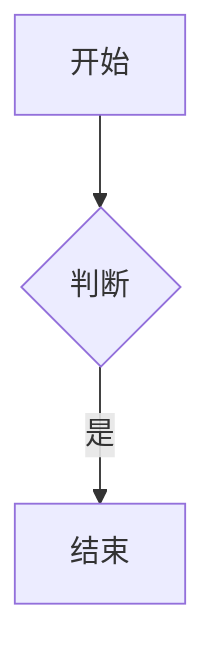

# 站点可用元素清单

对象：`/projects/site`（Hugo Theme Stack，4 语言，Hugo v0.167.0 extended）
性质：**实测清单**，不是通用文档。每一条都对应主题/配置里的真实代码位置。
用途：写文章时对照；也是后续编辑器「元素面板」的候选来源。

---

## 0. 一页速查

| 元素 | 写在哪 | 当前状态 | 一句话 |
|---|---|---|---|
| 提示块 Callout | 正文 `> [!NOTE]` | ✅ 可用 | 5 种类型，带 emoji 图标 |
| 图片（响应式） | 正文 `` | ✅ 可用 | 自动多尺寸 + 懒加载 + 宽高比 |
| 相册 + 灯箱 | 正文同一行多张图 | ✅ 可用 | 自动成组，点击全屏 PhotoSwipe |
| 数学公式 | 正文 `$$…$$` | ⚠️ 需 front matter `math: true` | KaTeX 渲染 |
| Mermaid 图 | ` ```mermaid ` 代码块 | ✅ 自动识别 | 带缩放/全屏弹窗，深浅色自适应 |
| 代码块 | 正文 ` ``` ` | ✅ 可用 | 行号 + 语法猜测 + 一键复制 |
| 原始 HTML | 正文直接写 | ✅ 可用 | `unsafe = true` |
| 外链 | 正文 `[](https://…)` | ✅ 自动 | 新窗口 + `noopener` + 图标 |
| 标题锚点 | 正文 `## 标题` | ⚠️ 主题默认关 | 开 `headingAnchor` 才有 `#` 链接 |
| 摘要分隔 | 正文 `<!--more-->` | ✅ 可用 | 控制列表页摘要长度 |
| shortcode ×6 | 正文 `` | ✅ 可用 | 引用/YouTube/B站/腾讯视频/本地视频/GitLab |
| 页面配色 | front matter `style:` | ✅ 可用 | 给分类、标签页配卡片色 |
| 侧边栏组件 | `params.toml` | ✅ 已配 4 种 | search / archives / categories / tag-cloud |
| 评论 | `params.toml` | ✅ 已开（Disqus） | 14 种 provider 可选 |
| 相关文章 | `related.toml` | ✅ 已配 | 按 tags、categories 加权 |
| 链接页 | front matter `links:` | ✅ 已用 | 卡片式友情链接列表 |

---

## 1. 正文元素（直接写在 Markdown 里）

### 1.1 提示块 / Callout ✅
来源：`layouts/_markup/render-blockquote.html`（`.Type == "alert"` 分支）

```markdown
> [!NOTE]
> 这是普通说明。

> [!TIP]
> 这是小技巧。

> [!IMPORTANT]
> 这是重点。

> [!WARNING]
> 这是警告。

> [!CAUTION]
> 这是危险提示。
```

- 5 种合法类型：`note` `tip` `important` `warning` `caution`
- 默认图标来自 `article.alertIcon`：📝 💡 📌 ⚠️ 🚨（可在 `params.toml` 改）
- 标题可以自定义：`> [!NOTE] 自定义标题`（对应 `.AlertTitle`）
- 没自定义标题时，标题**按语言自动本地化**（i18n `article.alert.*`）：中文下显示 备注 / 提示 / 重要 / 警告 / 注意
- 普通 `> 引用` 仍然走原来的 blockquote 分支，不受影响

### 1.2 图片与相册 ✅
来源：`layouts/_markup/render-image.html` + `assets/ts/gallery.ts` + `photoswipe.html`

```markdown


       ← 同一行，中间两个空格 = 自动相册
```

- 单张图：自动生成 `srcset`（800/1600/2400 宽），带宽高比、懒加载
- 同一行/同一段内的多张图：自动加 `gallery-image`，并用 flex 自动排版成相册
- 相册点击 → PhotoSwipe 全屏灯箱（`.article-content` 内有图才加载脚本）
- 图片查找顺序：page bundle 内的资源文件 → `static/` → 外链
- SVG 等无尺寸的图不会进相册逻辑

### 1.3 数学公式 ⚠️ 需开关
来源：`_partials/article/components/math.html` + `markup.toml` 的 passthrough

在 front matter 里开：
```yaml
math: true
```
然后正文可用四种定界符：
```markdown
行内 $E = mc^2$ 或 \(a^2+b^2=c^2\)

$$
\int_0^\infty e^{-x^2}\,dx = \frac{\sqrt{\pi}}{2}
$$
```
- 渲染器是 **KaTeX**（不是 MathJax），从 `data/external.toml` 指定的 CDN 加载
- 全局开关：`params.toml` 的 `[article] math = true`（当前未开，所以只能逐页开）

### 1.4 Mermaid 图 ✅ 无需开关
来源：`layouts/_markup/render-codeblock-mermaid.html`

````markdown

````
- 只要出现 `mermaid` 代码块就自动加载，**不需要 front matter 开关**
- 自带全屏弹窗：Zoom In/Out、Reset、Fit to Screen、Esc 关闭
- 深浅色主题自动切换；配置项在 `params.toml` 的 `[article.mermaid]`
  （`look = classic|handDrawn`、`securityLevel`、`transparentBackground` 等）
- 注意：默认 `securityLevel = "strict"`，节点标签里的 HTML（如 `<br/>`）不生效，要改 `loose`

### 1.5 代码块 ✅
来源：`markup.toml` 的 `[highlight]` + `assets/ts/code-copy.ts`

````markdown
```js
const a = 1;
```
````
- 行号默认开（`lineNos = true`），从 1 开始，表格式行号
- 语言省略时自动猜测（`guessSyntax = true`）
- Tab 宽度 4
- 每块右上角有复制按钮
- 行内高亮：Hugo 的 `hl_lines`，写法 `` ```js {hl_lines=[2,4]} ``
- 未指定语言时也可以写 `` ```text `` 强制纯文本

### 1.6 原始 HTML ✅
`markup.toml` 里 `unsafe = true` → 可以直接写 HTML，不会被转义：
```markdown
<div style="display:flex;gap:8px">
  <span>左</span><span>右</span>
</div>
```
（这也是唯一能做真正自由排版的手段；shortcode 之外没有别的块级扩展机制）

### 1.7 链接 ✅
来源：`layouts/_markup/render-link.html`
- 以 `http` 开头 → 自动 `target="_blank" rel="noopener"`
- 所有链接套 `.link` 样式
- 可加 title：`[文字](https://x.com "悬停提示")`
- 站内链接建议用相对路径 → Hugo 会自动处理多语言前缀

### 1.8 标题锚点 ⚠️ 主题默认关
来源：`layouts/_markup/render-heading.html`
- `params.toml` 里 `[article] headingAnchor = false` → 现在标题**没有**可点击的 `#` 锚点
- 改成 `true` 即可获得悬停锚点链接
- 标题 `id` 一直都有（`{{ .Anchor }}`），所以锚点跳转本身可用

### 1.9 摘要分隔 ✅
```markdown
<!--more-->
```
- 列表页只显示它之前的内容
- 没有它时 Hugo 自动按字数截取

### 1.10 Goldmark 默认语法 ✅
表格、脚注、任务列表、删除线、自动链接等标准扩展都在。

---

## 2. 内置 shortcode（共 6 个）

来源：`layouts/_shortcodes/*.html`

### 2.1 quote — 带出处的引用 ✅
```markdown
{}
引用的内容，**支持 Markdown**。
{}
```
| 参数 | 必填 | 说明 |
|---|---|---|
| `author` | 否 | 作者名 |
| `source` | 否 | 出处；给了 `url` 时变成链接 |
| `url` | 否 | 出处链接 |

### 2.2 youtube ✅
```markdown


```
参数：视频 ID（位置参数或 `id=`），可选 `autoplay`。
受 `privacy.youtube` 配置控制（可切换 `youtube-nocookie.com`）。

### 2.3 bilibili ✅
```markdown

          ← 第二个参数是分 P
```
参数：`av…` 或 `BV…` 号；可选分 P（默认 1）。号写错会渲染出红色错误提示。

### 2.4 tencent — 腾讯视频 ✅
```markdown

```

### 2.5 video — 本地视频 ✅
```markdown

```
| 参数 | 说明 |
|---|---|
| `src`（或位置参数） | 视频地址 |
| `poster` | 封面图 |
| `autoplay` / `muted` | 取字符串 `"true"` 才生效 |

### 2.6 gitlab — 嵌入 GitLab 代码片段 ✅
```markdown

```
参数：GitLab snippet ID。

> ℹ️ 站点自己的 `content/post/shortcodes/{index,index.en,index.ja,index.zh-hant-tw}.md` **同时**演示了两种写法：
> - **真实渲染**：直接写 `` → 页面上出现真的引用块 / 视频播放器
> - **展示源码**：写在代码围栏里，且必须转义成 ``，否则围栏内也会被执行
>
> 以后要贴示例代码，记得用 `` 这个写法。

---

## 3. Front Matter 键（这个站点真实用过 + 主题会读的）

### 3.1 基础
| 键 | 类型 | 说明 |
|---|---|---|
| `title` | string | 标题 |
| `description` | string | 描述，用于列表页与 SEO |
| `date` | date | 发布日期 |
| `lastmod` | date | 更新日期；`SortBy = lastmod` 时用于排序 |
| `slug` | string | URL 片段，配合 `post = "/p/:slug/"` |
| `draft` | bool | 草稿，构建时排除（`-D` 才显示） |
| `author` | string | 作者 |
| `categories` / `tags` | list | 分类与标签，参与相关文章加权 |

### 3.2 显示控制
| 键 | 默认 | 说明 |
|---|---|---|
| `image` | — | 封面图；可写 bundle 内的文件名，也可写外链 |
| `toc` | `true` | 是否显示目录（兼容对象写法 `toc: {…}`） |
| `math` | `false` | 开 KaTeX |
| `comments` | `true` | `false` 关闭本页评论 |
| `license` | 站点默认 | `false` 关闭，或直接写一段 Markdown 覆盖 |
| `readingTime` | `true` | 是否显示阅读时长 |
| `build.list` | `always` | `never` 隐藏此页不出现在列表 |

### 3.3 页面类型与导航
| 键 | 例子 | 说明 |
|---|---|---|
| `layout` | `"archives"` / `"search"` / `"links"` | 选页面模板（归档/搜索/友链） |
| `outputs` | `[html, json]` | 搜索页需要 json 输出 |
| `menu.main` | `{ weight: -90, params: { icon: user } }` | 加入主菜单；`icon` 用 Tabler 图标名 |
| `style` | `{ background: "#2a9d8f", color: "#fff" }` | 分类/标签页的卡片配色 |

### 3.4 特殊页面数据
`links:` —— 友情链接页专用（见 `content/page/links/index.md`）：
```yaml
links:
  - title: GitHub
    description: GitHub 是世界上最大的软件开发平台。
    website: https://github.com
    image: https://github.githubassets.com/images/modules/logos_page/GitHub-Mark.png
```

### 3.5 文章骨架（主题 archetype）
`themes/hugo-theme-stack/archetypes/default.md` 给出的默认结构：
```yaml
title:
description:
date:
image:
math:
license:
comments: true
draft: true
build:
    list: always
```

---

## 4. 站点级配置能力

### 4.1 语言（4 种，默认 zh）
来源：`config/_default/languages.toml`
| 代码 | 名称 | weight |
|---|---|---|
| `zh` | 简体中文 | 1 |
| `en` | English | 2 |
| `zh-hant-tw` | 正體中文 | 3 |
| `ja` | 日本語 | 4 |

文件名后缀决定语言：`index.md`=默认(zh)、`index.en.md`、`index.zh-hant-tw.md`、`index.ja.md`。
同名不同语言的文件会被视为**同一篇文章的翻译**（靠文件名分组）。
主题内置 **32 种** i18n 语言，加语言只需在 `languages.toml` 加一节。

### 4.2 侧边栏组件（widget）
来源：`layouts/_partials/widget/`，可用类型：`search` `archives` `categories` `tag-cloud` `taxonomy` `toc`

当前配置：
```toml
[widgets]
    homepage = [ search, archives(limit=5), categories(limit=10), tag-cloud(limit=10) ]
    page     = [ toc ]
```
想加别的，把 `taxonomy` 之类换上去即可。

### 4.3 评论
14 种 provider 已内置：`artalk beaudar cactus comentario cusdis disqus disqusjs giscus gitalk remark42 twikoo utterances vssue waline`
当前：`provider = "disqus"`（`hugo.toml` 里 shortname = `hugo-theme-stack`）。

### 4.4 相关文章
`config/_default/related.toml`：tags 权重 100、categories 权重 200、阈值 60、含新文章。

### 4.5 图片处理
`params.toml` 的 `[imageProcessing.content]`：宽度 800 / 1600 / 2400，缩略图开启。
站点未开 `autoOrient`。

### 4.6 其它已配置项
- 分页：`pagerSize = 3`（每页 3 篇）
- 永久链接：`post → /p/:slug/`，`page → /:slug/`
- 目录：2–4 级（`startLevel = 2, endLevel = 4`，有序）
- 深浅色：`colorScheme.toggle = true`，默认 `auto`
- RSS：全文输出
- 社交图标：github、twitter（`menu.toml`）
- Cookie 同意：**关闭**
- 页脚：`since = 2020`
- 文章默认许可：CC BY-NC-SA 4.0（已启用）

---

## 5. 依赖外部 CDN 的元素（离线/国内网络注意）

来源：`themes/hugo-theme-stack/data/external.toml`

| 元素 | 依赖 |
|---|---|
| 数学公式 | KaTeX 0.16.9（jsdelivr） |
| Mermaid | mermaid@11（jsdelivr）+ 主题自身 ts |
| 相册灯箱 | PhotoSwipe 5.4.4（jsdelivr） |
| 其它评论 provider | 各自的 CDN（当前 Disqus 自身域名） |

即：**公式/图表/灯箱在无外网时会退化为代码或纯文本**，正文与代码块不受影响。

---

## 6. 编辑器机会点（供你挑选，尚未实现）

按「作者最常用 → 最少用」排序：

| 元素 | 编辑器可以怎么做 | 难度 |
|---|---|---|
| 提示块 Callout | 工具栏 5 个按钮，插入 `> [!X]` 骨架 | 低 |
| shortcode ×6 | 带参数表单的插入面板（视频号、引用出处） | 低 |
| 图片/相册 | 拖拽插入、自动成组、提示「两个空格成相册」 | 中（依赖 P4） |
| Front Matter 表单 | 托管字段表单 + 只读展示未知字段 | 中（P2 计划内） |
| 数学公式 | 行内/块级按钮 + 实时 KaTeX 预览 | 中 |
| Mermaid | 代码块旁的图预览（需内嵌 mermaid 渲染） | 中 |
| 侧边栏/评论/语言 | 站点设置面板（写 `params.toml` / `languages.toml`） | 高（P5 计划内） |
| 页面配色 style | 分类/标签页的颜色选择器 | 低 |
| 图标名 | 菜单 `params.icon` 的图标选择器 | 低 |

---

## 7. 怎么安全地试这些元素（完全不碰 site/）

Hugo 允许临时覆盖 content 目录，所以可以用一个独立临时目录来试元素，站点一个字节都不会动：

```bash
mkdir -p /tmp/demo/content/post/demo
# 在 /tmp/demo/content/post/demo/index.md 里随便写
/projects/.bin/hugo --source /projects/site \
    --contentDir /tmp/demo/content \
    --destination /tmp/demo-out \
    --cacheDir    /tmp/demo-cache
# 产物在 /tmp/demo-out，用任意静态服务器打开即可
```

本清单里的 ✅ 就是这么验证出来的：建了一个包含上述全部元素的临时页面，构建后逐项在产物 HTML 和浏览器里确认实际渲染结果（提示块类名、KaTeX 是否出符号、Mermaid 是否带 Expand 按钮、代码块是否走 Chroma、原始 HTML 是否保留等）。

---

*本清单由实测生成：主题 `theme.toml` / `config/_default/*.toml` / `layouts/**` / `archetypes/**` / `data/external.toml`。*
*站点内容与配置未被本清单修改。*
