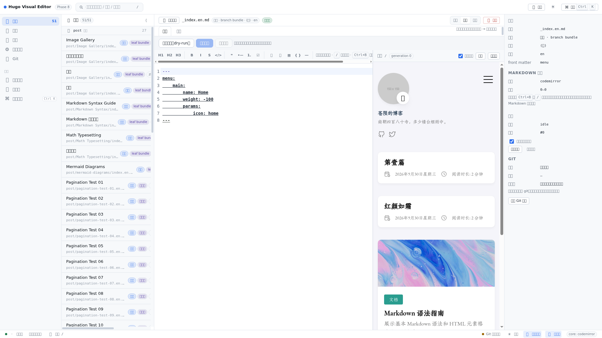
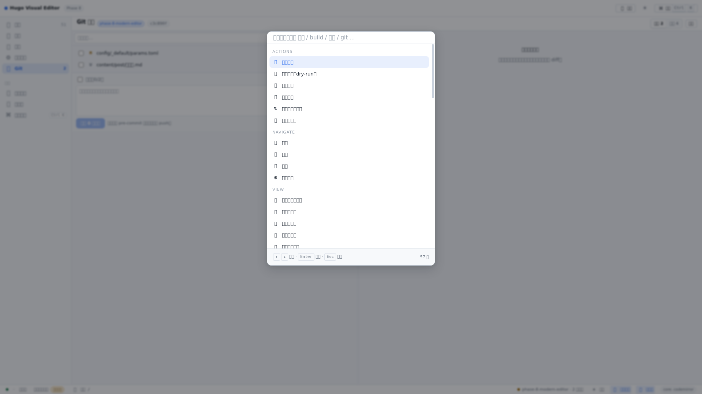
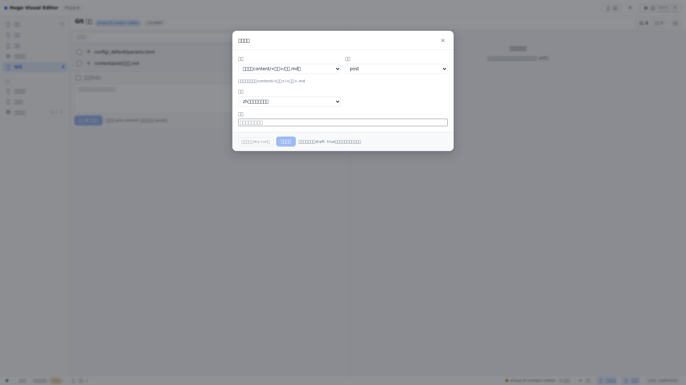
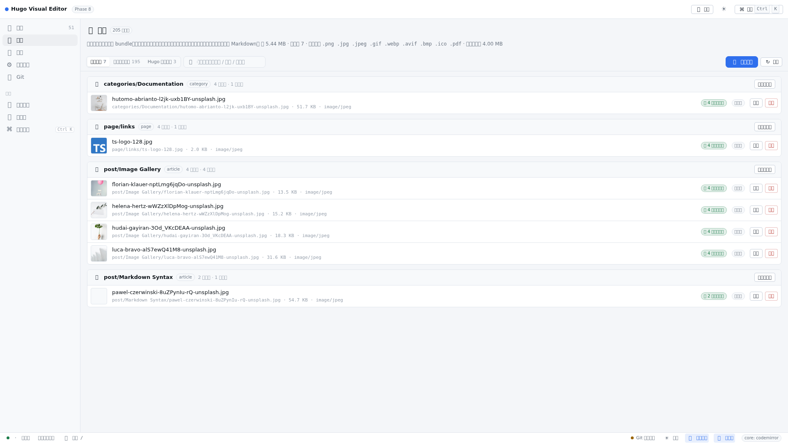
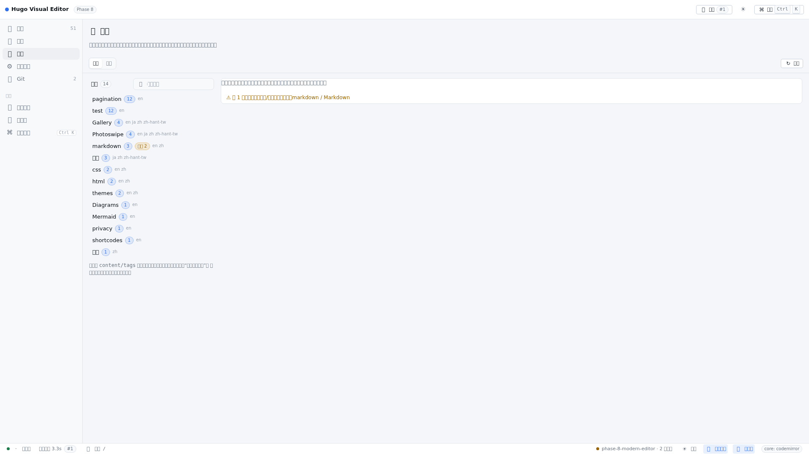
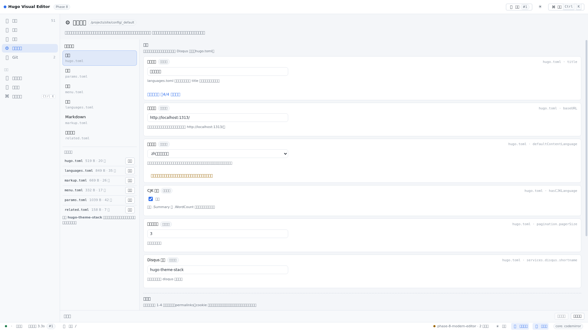
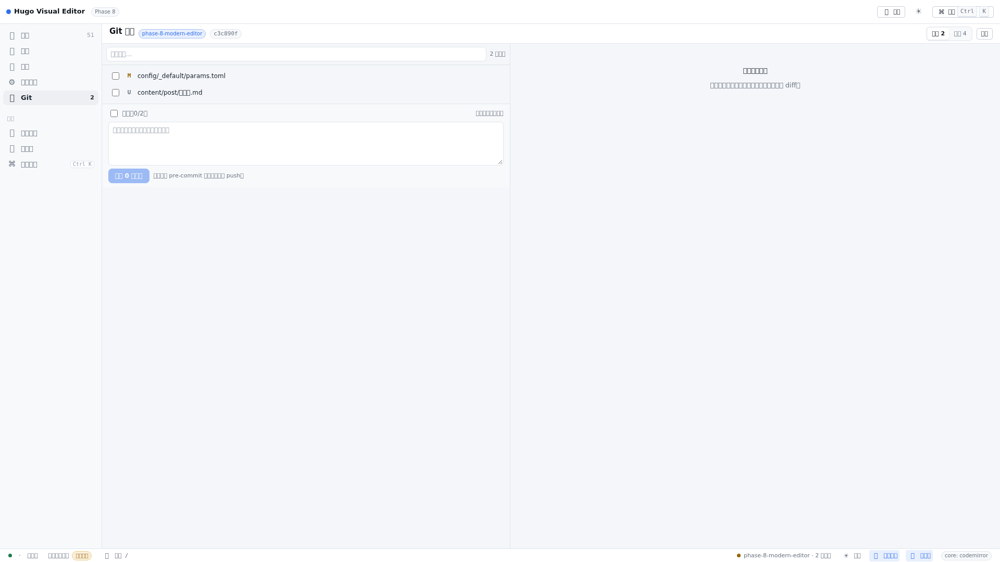
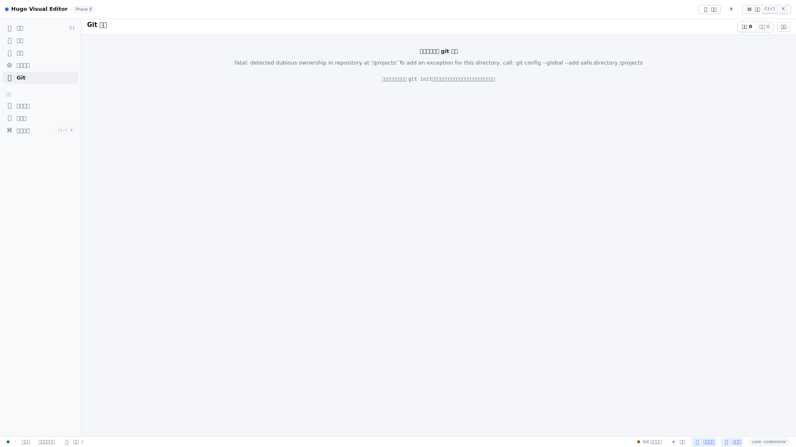
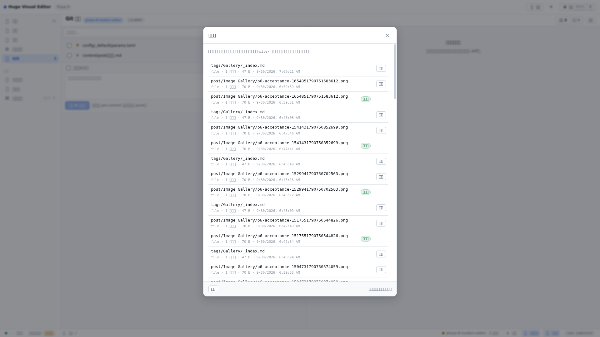

# Hugo Visual Editor 用户手册

> 本手册面向**站点的使用者**（写文章、改配置、发布的人），不是实现说明。它描述的是 Phase 8
> 完成后的编辑器：你在界面上真正能点到的东西、每个按钮会写哪些文件、以及写不下去时它为什么拒绝。
>
> 实现层面的取舍与历史（为什么某个设计是这样）请看 `../AGENTS.md` 与 `docs/` 下的分阶段文档。

## 0. 适用版本与环境（写本手册时实测）

| 项目 | 值 |
| --- | --- |
| 编辑器阶段 | Phase 8（统一 shell + 设计系统 + Markdown 输入） |
| 站点 | `site/`（Hugo 项目，主题 `hugo-theme-stack`） |
| Hugo | `v0.167.0 extended`（`/projects/.bin/hugo`，也可用 `HUGO_BIN` 指定） |
| Node | `>= 20`（实测 `v24.21.0`） |
| 编辑器进程 | `node server/index.js`（默认 `0.0.0.0:1313`） |
| 实测提交 | 分支 `phase-8-modern-editor`，HEAD `c3c890f` |
| 实测站点规模 | 51 篇文档（`post 27 / page 16 / categories 4 / 根 4`）、11 个 bundle、7 个内容资源、195 个静态文件、3 个管线资源、14 个标签 |

本手册中的截图来自真实运行的编辑器（站点是你自己的站点），不是示意图。图内出现的文章名、
路径、计数都是当时磁盘上的真实状态。

## 目录

1. [它是什么，以及三条核心规则](#1-它是什么以及三条核心规则)
2. [启动与打开](#2-启动与打开)
3. [界面总览](#3-界面总览)
4. [快捷键与命令面板](#4-快捷键与命令面板)
5. [内容视图：文章、页面、分类页](#5-内容视图文章页面分类页)
6. [新建文档](#6-新建文档)
7. [资源（图片与其它文件）](#7-资源图片与其它文件)
8. [关系：标签与链接](#8-关系标签与链接)
9. [站点设置](#9-站点设置)
10. [Git 面板](#10-git-面板)
11. [回收站](#11-回收站)
12. [构建与预览](#12-构建与预览)
13. [文件与目录布局](#13-文件与目录布局)
14. [常见任务（手把手）](#14-常见任务手把手)
15. [行为边界与已知限制](#15-行为边界与已知限制)
16. [故障排查](#16-故障排查)
17. [开发者：测试与验收](#17-开发者测试与验收)
- [附录 A：HTTP 接口一览](#附录-ahttp-接口一览)
- [附录 B：快捷键与斜杠命令](#附录-b快捷键与斜杠命令)
- [附录 C：站点设置可编辑键](#附录-c站点设置可编辑键)
- [附录 D：术语表](#附录-d术语表)
- [附录 E：本书的验证记录](#附录-e本书的验证记录)

---

## 1. 它是什么，以及三条核心规则

编辑器是一个**本地服务**：它读你的 Hugo 项目、按你的点击改文件、调用 Hugo 构建、并把构建结果
直接当预览给你看。它不是一个数据库，也没有私有格式——**你的站点永远是磁盘上那些 Markdown 和
TOML 文件本身**。

界面里所有写操作都遵守三条规则：

**规则 1：先看计划，再写盘。** 每一次修改都是两步：

```
预览 / dry-run（不写任何字节）  →  确认（备份 → 原子写入 → 回读校验）
```

保存正文要「预览变更（dry-run）」→「确认保存」；新建文档要「生成计划（dry-run）」→「确认创建」；
删除要「生成计划（dry-run）」→「确认删除（移入回收站）」；设置要「预览改动」→「确认保存」；
标签与链接要「预览…」→「确认执行」；资源上传/替换/删除同样是「计划」→「确认写入」。
按钮不可点时，旁边的提示会说明缺哪一步（最典型的是「必须先预览，且内容未再变化，才能保存」）。

**规则 2：内容没变就不写。** 如果一次保存/替换的结果与磁盘上的内容逐字节相同，编辑器返回
*no-op*，**不会**产生备份、不会更新时间戳、不会触发构建。这样「重复点一次保存」不会污染历史。

**规则 3：删除是「移动」，不是「抹掉」。** 删除的文档与资源会进入编辑器自己的回收站
（`editor/.backups/trash/`），可以按原路径、按原字节恢复。编辑器不会改写 Markdown 里的引用，
所以删掉一张还在被引用的图片，文章里的链接会断——界面会在删除的资源上标出「被 N 份文档引用」，
但它不会替你改文章。

数据流只有一条方向：

```
site/（唯一被编辑的源） →  Hugo 构建（暂存目录） →  site/public（只有构建成功才发布） →  浏览器预览
```

三条推论，值得记住：

- **构建失败不会破坏预览。** Hugo 写向暂存目录，只有退出码为 0 才会发布到 `site/public`；失败时
  预览保持上一次成功的输出。
- **`site/public/` 不是源。** 它是构建产物，编辑器发布会覆盖/清理它（只清理编辑器自己发布过、
  且没有被你手工改过的文件）。不要手工编辑 `public/`。
- **只有两处可写：`site/content/` 与 `site/config/_default/` 的少数文件。** `site/static/`、
  `site/assets/` 只读（只列出与预览），主题目录从不写入。

## 2. 启动与打开

### 2.1 前置条件

- Node.js ≥ 20（`node -v`）。
- Hugo extended 二进制。查找顺序：环境变量 `HUGO_BIN` → `/projects/.bin/hugo` → PATH 里的
  `hugo`。站点自带的是 `/projects/.bin/hugo`（v0.167.0 extended）。
- 首次启动不需要 `npm run build:web` 之外的步骤；但**改了前端代码就必须重新构建一次**
  （见 2.4）。

### 2.2 启动（一条命令）

```bash
cd /projects/editor
npm start                 # 等价于 node server/index.js
```

启动横幅会打印生效的配置，这是排查「它到底在看哪个目录」最快的办法：

```
Hugo Visual Editor (Phase 3) on http://0.0.0.0:1313
  editor page  : /editor/
  source       : /projects/site   (writable sections: post, page, categories, (content root))
  build        : /projects/.bin/hugo -> /tmp/hugo-editor-build/projects-site/output
  output       : /projects/site/public   (published only after a successful build)
  preview      : /
  backups      : /projects/editor/.backups
  watch        : on (poll 1500ms; native watch is only an accelerator)
  auto build   : on save = true
  git          : git (read + commit of selected paths only; never init/reset/clean)
```

> 横幅第一行写的是 `(Phase 3)`：这是历史遗留字符串，界面本身是 Phase 8（见第 15 节的已知问题）。

### 2.3 打开

| 地址 | 内容 |
| --- | --- |
| `http://127.0.0.1:1313/editor/` | 编辑器界面 |
| `http://127.0.0.1:1313/` | 你的博客（编辑器服务器直接提供 `site/public` 的构建输出） |

也就是说：**一个进程同时提供博客和编辑器**，不需要再单独跑 `hugo server`。预览用的是
*已构建的静态输出*，所以它和线上产物逐字节一致；代价是没有 Hugo 开发服务器的 live reload
（改完保存 → 编辑器构建 → 预览自动重新指向新结果，见 12.4）。

### 2.4 前端构建（什么时候需要）

界面（Vue + Vite）要先构建成 `editor/dist/`，由服务器按 `/editor/` 提供：

```bash
cd /projects/editor
npm run build:web         # vite build → editor/dist
```

只改 Markdown/配置、只用界面时**不需要**这一步；改了 `editor/web/` 下的源码才需要重新构建并刷新
浏览器。

### 2.5 常用启动参数（程序化）

`createEditorServer(options)` / `startEditorServer(options)` 接受覆盖项，常用的是：

| 参数 | 默认值 | 说明 |
| --- | --- | --- |
| `port` / `host` | `1313` / `0.0.0.0` | 监听地址 |
| `siteRoot` / `contentRoot` / `configRoot` | `/projects/site` 等 | 源、内容、配置文件根 |
| `publishDir` | `/projects/site/public` | 预览输出 |
| `backupRoot` | `editor/.backups` | 备份 + 回收站 |
| `watchSources` | `true` | 监听源文件变化 |
| `autoBuildOnSave` | `true` | 保存后自动构建 |
| `buildOnStart` | `true`（隐含） | 启动时若 `public/index.html` 不存在，自动构建一次 |
| `hugoBin` / `buildTimeoutMs` | `/projects/.bin/hugo` / `180000` | 构建命令与超时 |
| `pruneOutputs` | `true` | 删除资源时同步删除它已发布的产物 |

**第二个只读实例**（不干扰正在运行的编辑器，也不写站点）：

```bash
cd /projects/editor
npm run build:web
node -e "import('./server/index.js').then((m) =>
  m.createEditorServer({ port: 8912, host: '127.0.0.1', watchSources: false, autoBuildOnSave: false })
   .listen(8912))"
# 打开 http://127.0.0.1:8912/editor/
```

这条命令在排障时很有用：`watchSources:false` + `autoBuildOnSave:false` 表示它**不会**因为你的
浏览而写盘或构建（界面状态栏会显示「手动构建」徽标）。

## 3. 界面总览



界面由四块组成，位置固定，任何视图都不改变它们：

### 3.1 顶栏（topbar）

| 区域 | 元素 | 作用 |
| --- | --- | --- |
| 左 | 应用名 `Hugo Visual Editor` + `Phase 8` | 版本标识 |
| 中 | 筛选文档输入框（`筛选文档（路径 / 标题 / 类型）`） | 过滤左侧文章列表，匹配路径/标题/类型；列表关闭时搜索会自动展开列表 |
| 右 | `🏗 构建` | 立即构建站点（等价于检查器里的「立即构建」） |
| 右 | `☀️` 主题按钮 | 浅色/深色切换 |
| 右 | `⌘ 命令 Ctrl K` | 打开命令面板 |
| 左列 | 主导航：`📄 内容 51`、`🖼 资源`、`🔗 关系`、`⚙️ 站点设置`、`🌿 Git` | 五个主视图；`内容` 上的数字是文档总数，`Git` 上的数字是未提交变更数 |
| 左列 | `工具`：`➕ 新建文档`、`🗑 回收站`、`⌘ 命令面板 Ctrl K` | 对话框与面板 |

### 3.2 三栏工作区

- **文章选择栏**（左，`文章 51/51`）：按分区分组（`post 文章 27`、`page 页面 16`、`categories`、
  根），每行是标题（缺标题时回退到目录名或路径）；行内徽标表示语言版本数、`草稿`。
  它**默认展开**，只能由你收起（工作区标题的 `📄 文章列表`、状态栏的 `文章列表`、或命令面板的
  `隐藏文章列表`）。
- **工作区**（中）：当前文档的编辑区。标题栏显示路径、`类型 · 形态 · 分区 · 语言`、`已保存/未保存`、
  `编辑/分栏/预览` 三档布局、`🗑 删除`、`原文/表单` 两个标签、以及保存相关的三个按钮。
- **检查器**（右，`🔎 检查器`）：文档事实（路径、类型、分区、语言、front matter 键）、
  Markdown 输入（内核名、选区范围）、构建（状态、`#代次`、`保存后自动构建` 勾选框、`立即构建`、
  `显示日志`）、Git（仓库、分支、本文档的改动、`打开 Git 面板`）。
  窄于 1200px 时检查器会被隐藏（分栏布局下的预览面板也会跟着隐藏）；文章列表则只是变窄，
  不会被藏起来。

### 3.3 状态栏（底部）

| 元素 | 含义 |
| --- | --- |
| `· 未修改` / `未保存` / `正在保存` / `已保存` / `保存失败` | 编辑器状态（悬停提示「编辑器状态：…（Ctrl+S 保存）」） |
| `等待首次构建` / `构建就绪` / `正在构建…` / `构建成功 3.2s` / `构建失败` | 构建状态；`手动构建` 徽标表示「保存后自动构建」已关闭 |
| `🔗 预览 /` | 打开预览（点击后切到预览布局） |
| `phase-8-modern-editor · 2 处变更` / `· 干净` / `Git 未初始化` | Git 状态；点击打开 Git 面板 |
| `☀️ 系统` | 主题（浅色/深色/跟随系统），点击循环切换 |
| `📄 文章列表`、`🔎 检查器` | 两栏的开关 |
| `core: codemirror` | 当前 Markdown 内核名，经适配器可替换 |

主题偏好保存在浏览器 `localStorage` 的 `hve.theme`（`light` / `dark` / `system`，跟随系统时会随
操作系统设置变化）。

## 4. 快捷键与命令面板

### 4.1 全局快捷键（真实绑定）

| 快捷键 | 行为 | 备注 |
| --- | --- | --- |
| `Ctrl/Cmd + K` | 打开/关闭命令面板 | 在编辑区里也生效（见 15.1 的提示冲突） |
| `Ctrl/Cmd + S` | 保存当前文档 | **先预览再保存**：等价于点「预览变更（dry-run）」再点「确认保存」；表单模式下等价于「预览变更」+「确认保存」。预览结果是 no-op 时不写盘 |
| `Esc` | 关闭命令面板 / 关闭对话框 | |
| `?` | 打开命令面板（仅在非输入状态） | 输入框、文本域、编辑区内不触发 |

编辑器内（Markdown 内核）还有一组命令键，见附录 B。

### 4.2 命令面板（Ctrl+K）



- 输入即模糊匹配（`nsart` 能找到 `新建文章`）；匹配范围是全名、命令 id 和关键词（中英文都有，
  例如 `保存` / `save`、`主题` / `theme`）。
- 分组顺序：`Actions`、`Navigate`、`View`、`Git`、`Documents`。
- 当前不可用的命令会显示成灰色并给出原因（例如「没有打开的文档」「没有未提交的变更」）；
  只有在你输入了搜索词时它们才会出现在结果里。
- 底部提示：`↑ ↓ 选择 · Enter 执行 · Esc 关闭`，右侧是当前结果数（`57 项`）。
- `Documents` 组列出最多 40 篇文档（`📝 <标题或路径>`），选中即打开。

### 4.3 全部命令

| 组 | 命令 | 快捷键 | 何时可用 |
| --- | --- | --- | --- |
| Actions | 新建文章 | | 总是 |
| Actions | 保存当前文档 | `Ctrl+S` | 有打开的文档、有未保存修改 |
| Actions | 预览变更（dry-run） | | 有打开的文档 |
| Actions | 放弃未保存的修改 | | 有未保存修改 |
| Actions | 构建站点 | | 总是 |
| Actions | 打开预览 | | 总是 |
| Actions | 重新读取内容树 | | 总是 |
| Actions | 打开回收站 | | 总是 |
| Navigate | 内容 / 资源 / 关系 / 站点设置 / Git 变更 | | 不在该视图时 |
| View | 切换到深色/浅色主题 | | 总是 |
| View | 主题：浅色 / 深色 / 跟随系统 | | 未处于该偏好时 |
| View | 隐藏/显示检查器 | | 总是 |
| View | 隐藏/显示文章列表 | | 总是 |
| View | 在内容中搜索 | `Ctrl+F`（**未绑定**，见 15.1） | 总是 |
| Git | 提交变更… | | 有未提交变更 |
| Git | 查看提交历史 | | 仓库可读 |
| Documents | `📝 <每篇文档>` | | 不是当前文档时 |

---

## 5. 内容视图：文章、页面、分类页

内容视图是默认视图，也是唯一能编辑 Markdown 的地方。

### 5.1 文章选择栏（左侧）

- 按**分区**分组，顺序固定为 `post`、`page`、`categories`、根（`(根)`），图标 `📝 / 📄 / 🏷`；
  组头右侧是文档数。
- 每行显示：标题 → `草稿` 徽标（`draft: true` 时）→ 相对路径 · 相对更新时间（`刚刚` / `N 分钟前`
  / `N 小时前` / `N 天前` / 日期）；行尾四个徽标：**类型**（文章/页面/分类/其它）、**形态**
  （单文件/leaf bundle/branch bundle）、**语言**（`zh` / `en` / `ja` / `zh-hant-tw`）、
  `×N`（该页面的语言版本数，鼠标悬停显示「该页面有 N 个语言版本」）。
- 标题缺失时的回退顺序：front matter 的 `title` → bundle 目录名 → 文件名 → 路径；站点首页显示为
  `(站点首页)`。
- 顶部搜索框按 路径/标题/类型 过滤（过滤时组徽标显示 `筛选中`）；列表关闭时搜索会自动展开它。
- 排序与计数由服务端给出（`GET /api/documents`：`count` + 按分区的 `sections[].count`）。
  本机实测：51 篇（`post 27`、`page 16`、`categories 4`、根 4）。

### 5.2 打开与两个编辑模式

| 标签 | 名称 | 编辑对象 | 保存按钮 |
| --- | --- | --- | --- |
| `原文` | 正文源码 | 整个文件（front matter + 正文） | `预览变更（dry-run）` → `确认保存` |
| `表单` | front matter 表单 | 仅 front matter 的字段 | `预览变更（dry-run）` → `确认保存` |

- **原文** 是所见即所得地编辑源文件本身，Markdown 从不离开文本形态（不存在 HTML/DOM 表示）。
- **表单** 是对 front matter 的*请求*，不是重写器：一个字段只有在引擎能无损改写它时才可编辑，
  否则旁边显示引擎给出的原因（例如 `值是嵌套映射（例如 menu / style），请在原文中编辑`、
  `值是一组映射（例如 links），表单不重写，请在原文中编辑`）。字段行右侧的 `✕` 才是「删除该字段」，
  **留空不等于清空**（`lastmod: ""` 会让 Hugo 解析日期失败）。表单不重排正文与缩进。
- 从表单切到原文时，表单里未保存的修改会被丢弃并提示「表单中未保存的修改已丢弃（切换到原文）。」。

### 5.3 保存：为什么「确认保存」是灰的

原文模式的保存条件（界面上写的规则）：

1. 至少点过一次 `预览变更（dry-run）`；
2. 预览之后你没有再改动文本（改了就要重新预览）；
3. 预览结果不是 *no-op*（内容与磁盘一致时不写盘，也不给你「保存」）；
4. 没有别的操作正在进行（`busy`）。

表单模式同理：至少预览过一次、`changed === true`、预览后表单编辑没有变化。

保存实际发生的事（`POST /api/documents/save` 带 `confirm: true`）：

```
路径守卫 → no-op 守卫 → 备份到 editor/.backups/<时间戳>/… → 原子写入（临时文件 + rename）
→ 回读校验（内容必须逐字节等于写入内容，否则报错）
```

保存结果会显示在检查器下方的「保存结果」卡片：`已写入 · sha xxxxxxxx`、`备份 <路径>`（或 `无`）、
`编辑器内容 == 磁盘内容`（回读校验）、`已触发构建` / `未触发构建`。

### 5.4 Markdown 输入（工具栏、斜杠菜单、键位）

编辑器内核是 CodeMirror 6（检查器里的 `core: codemirror`），当前能力：源码模式、选区感知、
Markdown 命令、只读支持；**没有** WYSIWYG 与分屏式富文本渲染。

**工具栏（16 个按钮）**：`H1 H2 H3` │ `B I S </>` │ `❝ •— 1. ☑` │ `🔗 🖼 ▦ { } ―`
（标题、粗体、斜体、删除线、行内代码、引用、无序/有序/任务列表、链接、图片、表格、代码块、分隔线）。
按钮下方一行提示：`只改选中的文字 · / 插入结构 · Ctrl+B 粗体 · Ctrl+K 链接`。

三条不会变的性质：

- 命令是**选区操作**：只改你选中的文字（未选中时按命令语义插入/包裹），文档其它部分逐字节不变。
- 命令是纯文本变换，**不可能写盘**；要写盘必须走「预览 → 确认」。
- 工具栏、斜杠菜单、快捷键走**同一张命令表**，所以三者行为一致。

**斜杠菜单**：在正文里输入 `/` 触发，列出全部结构命令（Heading 1/2/3、Bold、Italic、
Strikethrough、Inline code、Code block、Quote、Bullet list、Numbered list、Task list、Link、Image、
Table、Divider）。支持输入过滤（中文关键词也可以，如 `粗体`、`代码块`、`表格`），
`↑ ↓` 选择、`Enter`/`Tab` 插入、`Esc` 关闭；没有匹配时提示「没有匹配的结构，继续输入即可。」。

**对话框**：链接、图片、表格、代码块四个命令会打开对话框：

- 链接：`显示文字`、地址、可选 `标题`；会显示将要生成的 Markdown，并且**替换已有链接的地址**
  而不是嵌套第二个链接。
- 图片：替代文字（a11y）、路径/资源、或把图片拖进来/选择文件上传（上传走资源服务，见第 7 节）；
  同一 bundle 的已有资源可直接挑选。上传失败时 Markdown 不会被改动。
- 表格：列数、数据行数，生成标准 GFM 表格，插入后仍是可逐字编辑的 Markdown。
- 代码块：语言、代码（留空则插入空代码块，光标停在中间）。

### 5.5 查看预览

工作区右上角的 `编辑 / 分栏 / 预览` 切换布局；`预览` 布局里的预览面板：

- 内容来自真实构建输出，URL 带 `__hve=<构建代次>` 以避免旧缓存；
- `自动刷新`（默认开）——有新构建时代次变化，iframe 自动重新指向新结果；关闭后出现 `有新构建` 徽标，
  点 `刷新` 才更新；
- `新窗口` 在新标签页打开同一地址；
- 编辑器不会往预览里注入脚本，也不会写 `public/`。

### 5.6 删除文档

工作区的 `🗑 删除` 打开删除对话框，两种范围：

| 按钮 | 含义 | 影响 |
| --- | --- | --- |
| `只删这一个文件` | `document` | 只有一个文件（多语言文章只删当前语言那一份） |
| `删除整个 bundle（含各语言与资源）` / `删除该栏目页（各语言 _index.md 与资源，保留子页面）` | `bundle` | leaf bundle：整个目录；branch bundle：各语言 `_index.md` + 页资源，**子页面保留** |

对话框先用两个范围按钮生成计划，然后显示：类型、范围、目标、`Markdown N 个`、`资源文件 N 个`、
`合计 N 个文件 · 体积`、警告行、可展开的「将移动的文件（N）」与「会保留的内容（N）」，
以及「可恢复：文件会移入回收站，之后可以还原。」。**必须手动输入「删除」**才能点亮
`确认删除（移入回收站）`（这是该对话框默认开启的保护）。

单文件文档的 bundle 按钮是不可点的（提示「单文件文档只有它自己一个文件」）；站点首页
（`content/_index.md`）不能按 bundle 删除——它的「bundle」是整个内容树。

### 5.7 检查器里的文档事实

`文档` 卡片给出：路径、`类型 · 形态`、分区、语言、front matter 键列表（`（无）` 表示没有 front matter）。
`Markdown 输入` 卡片给出内核名与当前选区 `起点–终点`。这两处是「我现在到底在改哪个文件」的最快确认。

## 6. 新建文档



`➕ 新建文档`（左列工具、命令面板的 `新建文章`）打开对话框，四项输入：

| 字段 | 选项 |
| --- | --- |
| `形态` | `单文件（content/<目录>/名称.md）`、`leaf bundle（content/<目录>/名称/index.md）`、`branch bundle（content/<目录>/名称/_index.md）` |
| `目录` | `post`、`page`、`categories`（标注「（分类页目录）」） |
| `语言` | 站点已配置的语言；默认语言标注「（默认，无后缀）」→ 文件名不带后缀 |
| `标题` | 用来生成文件名（slug）与 `title` |

**slug 规则**：NFC 规范化 → 去首尾空白 → 转小写 → 空白（含全角空格）转 `-` → 去掉
`\ / : * ? " < > |` 与控制字符 → 合并连续 `-` → 去掉首尾 `-._`；为空时用 `untitled`。
中文/日文标题保留原字符（`相册`、`写真ギャラリー` 不会被清空）。

流程：`生成计划（dry-run）` → 显示 `路径`、`类型 · 形态 · 语言`，路径冲突时提示
`该路径已存在：<路径>`（创建**绝不覆盖**已有文件）→ `确认创建`。

新建文件的初始内容：

```markdown
---
title: <你输入的标题>
date: <今天>
draft: true
---
```

即**新文档一定是草稿**（`draft: true`），保存后立即触发一次构建；Hugo 默认不发布草稿，
所以草稿不会出现在站点上，直到你在表单/原文里把它改成 `false`（表单里有 `草稿` 开关）。

`categories` 目录用于给某个分类/标签词建立自己的描述页（`content/categories/<名称>/_index.md`），
这是让一个分类拥有独立说明与图片的唯一方式。

---

## 7. 资源（图片与其它文件）



`🖼 资源` 管理图片与其它二进制文件。页头写明总览与规则，例如本机实测：

```
资源 205 个文件
内容资源属于所在的 bundle：替换保持路径不变，引用继续有效；删除会移入回收站，且不会自动改写 Markdown。
共 5.44 MB · 可替换 7 · 可写类型 .png .jpg .jpeg .gif .webp .avif .bmp .ico .pdf · 单文件上限 4.00 MB
```

### 7.1 三个范围

| 标签 | 位置 | 计数（实测） | 可写？ |
| --- | --- | --- | --- |
| `内容资源` | `content/<bundle>/<文件>` | 7 | ✅ 上传 / 替换 / 删除 |
| `站点静态文件` | `static/` | 195 | ❌ 只列出与预览 |
| `Hugo 管线资源` | `assets/` | 3 | ❌ 只列出与预览 |

后两个范围不可写的原因写在界面上：它们由站点直接使用（`static/` 原样发布）或交给 Hugo 管线
（`assets/`），替换或删除它们**没有可校验的反向引用**，所以编辑器拒绝写入。

### 7.2 内容资源视图

- 按 **bundle** 分组：`📦 <bundlePath>`（内容根目录显示为 `（内容根目录）`）+ 类型徽标 +
  `N 份文档 · N 个资源`；每个 group 有一个 `上传到此处` 按钮（不可写时按钮禁用并给出原因，
  例如 `内容根目录不是 bundle，本阶段不支持上传到此处`）。
- 每个资源：预览缩略图、文件名、路径 · 体积 · MIME、`被 N 份文档引用`（或 `未被引用`）、
  `可替换` / `只读` 徽标，以及 `替换`（选择文件）与 `删除` 两个动作。
- 顶部工具：`➕ 上传资源`（先选目标 bundle）、`↻ 刷新`；搜索框 `筛选资源（文件名 / 路径 / 类型）`，
  过滤时显示 `已筛掉 N 个` 与 `清除`。
- 底部「最近删除」卡片：显示最近一次删除的资源与 `回收站 id <id>`，并提供 `恢复`。

### 7.3 上传规则（为什么会被拒绝）

上传/替换都要同时满足：

1. **扩展名在白名单里**：`.png .jpg .jpeg .gif .webp .avif .bmp .ico .pdf`。
   其它扩展名（包括 **SVG**）一律拒绝——SVG 是可执行脚本的文档，会被同源提供，编辑器目前没有
   清洗器，所以它只被识别与列出，不可写。
2. **文件内容与扩展名一致**：编辑器读文件头做格式嗅探，内容看起来是别的格式时拒绝，例如
   `文件内容看起来是 image/png，与扩展名 .jpg 不符（允许：.png）`。把脚本改名成 `.png` 不可能落地。
3. **单文件 ≤ 4.00 MB**（HTTP 传输上限为 base64 后的 8 MB）。
4. **上传不覆盖**：目标已存在同名文件时给出建议名称（`已存在，建议改名 xxx`），你要么改名，要么用
   `替换`。

替换与删除：

- `替换` 保持路径不变（因此 Markdown 里的引用继续有效），写入前**先备份**；
  若新字节与旧字节完全相同，则返回 **no-op**（`内容未变，未写入`），不产生备份。
- `删除` 是**可逆移动**：文件进入回收站（`reason: asset-delete`），并且它**已发布的产物会一并删除**
  （发布器只删除「自己发布过、且字节未被手工改动」的输出，并清理空目录）。
- 恢复用 sha256 可以逐字节验证。

在 Markdown 里插入图片时（`🖼` 按钮 / 斜杠菜单的 `Image`）可以直接上传：对话框里会先显示
`上传计划`（目标路径与提示），确认后才写入；上传失败时 Markdown 不会被改动。

## 8. 关系：标签与链接



`🔗 关系` 有两个标签：`标签`（全站标签）与 `链接`（某一页 front matter 里的 `links:` 列表）。
页头写着这个视图的基本约定：

```
标签是站点级别的对象：改一个标签会改掉所有用到它的文档，所以先看改动清单再确认写入。
```

### 8.1 标签

**身份与写法是两件事。** Hugo 按 *term*（规范化后的值）归并标签：大小写折叠、NFC 规范化、
连续空白折叠——`markdown` 与 `Markdown` 是同一个标签；列表会把吸收掉的写法显示出来
（`同义 N` 徽标、`⚠ 有 N 个标签存在大小写/空白不同的写法`）。

标签列表与详情：

- 列表（左侧一列，一个标签一行，语言贴在行右端）：标签名、`N 份文档`；徽标 `同义 N`（多种写法）、
  `页`（有元数据页）、`孤立页`（没有文档使用）。
- 搜索框 `筛选标签`。
- 右侧详情：`N 份文档 · 语言 …`、`元数据页 <路径>`（或 `没有元数据页`）、同义写法提示、
  `新名称` 输入框 + `预览重命名` / `预览合并`、`元数据页` 的 `预览创建`。
- 按文档分组的标签编辑：每组 `N 个语言版本`，每个语言一行（标题、`写作 <原写法>`），
  `编辑标签` 展开 chips（`×` 移除），`新增标签，回车预览` + `预览新增`。
  新增不会覆盖已有标签；重复写法会被拒绝并说明原因。

关于**元数据页**：只有 `content/<taxonomy>/<名称>/_index.md`（本站为 `content/tags/<名称>/_index.md`）
才会成为某个 term 的元数据页；本站 `content/tags/` 默认不存在，所以**没有任何标签「缺少」元数据页**，
只有你明确点 `预览创建` 时才会创建。注意当前主题只渲染该页的 *title*，不渲染其正文。
重命名标签时目录会一起移动（Hugo 从目录名推导 URL，例如 `tags/Gallery 相册/` → `/tags/gallery-相册/`）。

**重命名 vs 合并：**

| 动作 | 何时可用 | 行为 |
| --- | --- | --- |
| 重命名 | 目标名在本站**未**被使用 | 改写所有用到该标签的文档的 front matter |
| 合并 | 目标名已被使用（重命名会被 **409** 拒绝） | 统一为目标写法，同一文档里重复的标签行会被去掉 |

当目标已被使用时，界面会出现「需要先决定」卡片：列出被 N 份文档使用过的事实，并给 `改为合并` 按钮
（也可以 `取消`）。

**执行是事务。** 标签/链接的写入单元是*变更集*（change set），不是单个文件：

```
prepare → validate → backup → write → read back → commit
```

任何一步失败都会**反向**回滚已应用的改动（例如 12 个文件改到第 7 个失败，前 6 个会被还原），
所以不会出现「一半文档改了名字」的状态。执行后的提示形如：

```
已执行：3 个文件变更（修改 3、新增 0、删除 0、移动 0），已安排构建
```

或 `没有文件需要写入（已经是目标状态）`。计划里还会分别列出「已跳过」（含原因）与
「已经是目标状态、不会写入」的文件。

### 8.2 链接

`links:` 是一组映射（本站是 `page/links/index.md` 及其各语言版本），形如：

```yaml
links:
  - title: GitHub
    description: ...
    website: https://github.com
    image: https://.../GitHub-Mark.png
```

步骤：

1. 选页面：`链接页` 快捷按钮（`page/links/index.md`）、手输 `content 下的路径` + `读取`，
   或从 `从文档列表里选（N）` 里挑。
2. 编辑器显示：`必填 title website`、`bundle <路径> · 键顺序 title → description → website → image`，
   每一项（`第 N 项`）可单独编辑字段、`上移` / `下移` / `删除`（可 `撤销删除`）。
3. `预览变更` → `确认执行`；也可以 `还原编辑` 放弃本地改动。

细节：

- 必填键是 `title` 与 `website`；`新增链接需要 title 与 website`。
- 新增项的键顺序**沿用文档自己的顺序**，缩进与格式也沿用该文档；编辑器不重排其它行。
- 图片引用会区分外部链接与本 bundle 的页面资源：`ts-logo-128.jpg` 这类引用一旦删掉源文件，
  链接就断了（编辑器不会自动改写）。
- 不是键值映射的项会原样保留并提示：`⚠ 第 N 项不是键值映射，已保留原样：…`。
- 编辑器只改 front matter 的 `links:` 块。页面**正文里**如果有同样的列表示例，它不会被触碰，
  也不会被计入（这是被测试固定住的行为）。

## 9. 站点设置



`⚙️ 站点设置` 是「TOML 之上的表单」，不是 TOML 重写器：**键顺序、注释、空行、引号与对齐都保留**，
没被你改动的键不会被重写。页头说明：

```
设置是文件里的键：这里显示每个键的值、它来自哪个文件，以及它是不是本站覆盖值。
主题默认配置只读，保存会在本站配置里写入覆盖值。
```

### 9.1 六个分组与对应文件

| 分组 | 文件 | 代表键 |
| --- | --- | --- |
| `常规` | `hugo.toml` | 站点标题、站点地址、默认语言、CJK 语言、每页文章数、Disqus 短名 |
| `外观` | `params.toml` | 站点图标、默认配色、允许切换明暗、头像/角标/副标题、列表排序、页脚起始年份与自定义文字、许可协议、阅读时长、目录、评论、Cookie 提示、首页/文章页侧栏组件 |
| `导航` | `menu.toml` | 社交菜单（每条 = 一个 `[[social]]`：标识/名称/链接/图标/新窗口；图标可填主题名、`phosphor-<名字>`，或用下拉选一张图片） |
| `语言` | `languages.toml` | 语言列表（名称/地区代码/排序/语言标题），以及各语言的标题、副标题等覆盖 |
| `Markdown` | `markup.toml` | 原始 HTML、数学公式透传、目录层级、代码高亮各项 |
| `相关文章` | `related.toml` | 包含更新的文章、相关度阈值、忽略大小写 |

页面分两列：左侧是小组列表，左下是「配置文件」列表（本机：`hugo.toml 519 B · 20 行`、
`languages.toml 849 B · 35 行`、`markup.toml 669 B · 26 行`、`menu.toml 332 B · 17 行`、
`params.toml 1039 B · 42 行`、`related.toml 158 B · 7 行`），右侧是当前分组的表单，
每个文件有 `原文` 按钮
（只读查看；页面明确写着「本视图只读：写配置一律经过设置表单，以避免手工编辑破坏 TOML 结构」）。
底部常驻一条状态栏：左边是 `未修改` / `待保存 N 处`，右边是 `预览改动` 与 `重新读取`。

### 9.2 值的来源：本站 vs 主题默认

- 行上的 `本站配置` 徽标 = 这个值写在本站的配置文件里。
- 输入框的 placeholder 显示 `主题默认：<值>` = 这个键本站没有写，Hugo 正在用主题的默认值。
  **保存它会向本站文件写入一个覆盖值**；主题自己的配置文件**从不被写入**。
- `各语言覆盖（N/M 已覆盖）`：`title`、`sidebar.subtitle` 这类键可以按语言覆盖；
  placeholder `继承：<值>` 表示该语言没有覆盖。**留空表示继续使用上层值**；
  目前不支持删除一个已有的覆盖。

### 9.3 特殊控件与校验

- `社交菜单`：每条可编辑标识/名称/链接/图标/新窗口，有 `删除`（可 `取消删除`）与 `新增一条`
  （`加入待保存`，三个必填项齐全才可点）。图标名不在主题中时提示
  `⚠ 图标 “xxx” 不在主题中，构建会失败`——这是提前告诉你 Hugo 会失败，而不是等构建报错。
- `图标` 有三种填法（输入框的候选列表里都有，后两种是本次新增的）：
  1. **主题图标名**：`brand-github`、`rss`、`link`……主题自带的 `assets/icons/*.svg`，原样写进 `menu.toml`。
  2. **Phosphor 图标**：写 `phosphor-<名字>`，共 1512 个名字（来自依赖 `@phosphor-icons/core`，
     如 `phosphor-github-logo`、`phosphor-mastodon-logo`）。名字写错会立刻报「没有名为 … 的 Phosphor 图标」。
  3. **一张图片**：用输入框下面的 `或从图片里选…` 下拉直接选（内容资源、`static/`、`assets/` 里的
     所有图片都在列），编辑器把它写成 `image:<位置>:<路径>`（`位置` = `content` / `static` / `assets`）。
  第 2、3 种会在**保存时**物化成一张 SVG 装进本站的 `assets/icons/`——主题的 `helper/icon.html`
  只认这个名字下的文件，找不到就中断构建。同名文件已存在时**绝不覆盖**（改用 `…-2.svg` 之类），
  所以你手画的图标不会被顶掉；保存后会自动构建，构建不过会在状态栏报错（见第 12 节）。
  预览（`预览改动`）会明确列出「将安装哪张 SVG」，而且预览本身不写任何文件。
- `首页/文章页侧栏组件`：组件类型来自主题里真实存在的 widget 模板；`其他参数：…（保留）` 表示
  编辑器不动它不认识的键；`移除` 把一个组件从列表里去掉。
- `语言` 表格：语言、名称、地区代码、排序、`默认` 徽标；表内提示「xx 的标题覆盖在“常规 · 站点标题”里设置」。
- `启用评论` / `评论提供方`（`外观` 分组）：评论区的开关与后端。站点是静态页面，评论区由访问者浏览器里的
  第三方脚本加载：**Disqus 拒绝在 `localhost` / `127.0.0.1` 上加载**，所以本地预览时它会把评论区换成一句
  占位文字（`Disqus comments not available by default when the website is previewed locally.` 与
  `comments powered by Disqus`）。本站因此把 `启用评论` 关掉了：关掉后文章页与 `关于` 这类页面都不再输出
  评论区，页面里也不会再有 Disqus 的脚本。另外 `常规` 分组里的 `Disqus 短名` 默认是主题自带的演示短名
  `hugo-theme-stack`，换成自己的短名才会加载自己的评论。

### 9.4 只读键（unmanaged）

面板底部的「只读键」列出设置表单**不管理**的键，它们来自更早的阶段（主题、permalinks、
Cookie 分类等），设置界面只读取它们，**保存时原样保留**。本机实测的只读键：

| 文件 | 键 |
| --- | --- |
| `hugo.toml` | `theme`、`permalinks.post`（`/p/:slug/`）、`permalinks.page`（`/:slug/`） |
| `params.toml` | `mainSections`、`rssFullContent`、`cookies.categories.analytics`、`cookies.categories.functional` |
| `markup.toml` | `goldmark.extensions.passthrough.delimiters.block`、`.inline` |
| `related.toml` | `indices` |

（站点没有声明 `[taxonomies]`，因此 Hugo 使用默认的 `categories` 与 `tags`——不要试图把它写进配置来
「修正」什么。）见附录 C 的完整可编辑键清单。

### 9.5 保存

底部状态：`未修改` 或 `待保存 N 处`；按钮 `预览改动`、`重新读取`。

1. `预览改动` → 对话框 `设置改动预览（未写入）`，标题就写明「未写入」，列出
   `将写入：<文件列表>`（没有改动时是 `（没有改动）`）。
2. `确认保存` → 先备份原文件，再原子写入并回读校验（对话框里写明了这一点），然后**安排一次构建**，
   所以改动会在发布的 HTML 里可见，而不只是文件变了。结果提示：

```
已写入 params.toml；备份 1 份；已开始重新构建。
```

如果「保存后自动构建」被关闭，最后一句会变成 `未触发构建（手动构建开关关闭）`。


---

## 10. Git 面板



`🌿 Git` 是本地的版本管理视图。它能做的只有两件事：**读**仓库，以及**提交你勾选的文件**。

### 10.1 变更标签

- 顶部：`变更 N` / `历史 N` 两个标签 + `刷新`；有改动时标题旁还有一个计数徽标
  `已暂存 N · 未暂存 M`。
- `筛选路径…` 过滤变更文件，右侧显示 `N / M` 或 `N 个文件`。
- 每行：状态字母（`M` 修改、`U` 未跟踪、`A` 新增、`D` 删除、`R` 重命名等）、路径，
  以及**它现在在哪一半**：`已暂存`（索引里已经有这次改动）与/或 `未暂存`（工作区里还有没进索引的改动）。
  一个文件可以同时有这两个徽标（git 里的 `MM`）。路径以**站点相对路径**显示
  （例如 `config/_default/params.toml`、`content/post/第壹篇.md`），即使仓库根在站点上一层。
- 计数口径（容易误会，写清楚）：`已暂存` / `未暂存` 只数**已被跟踪**的改动；**未跟踪**的新文件（`U`）
  既不算已暂存也不算未暂存，它们是自己的一个类别。所以在本站上看到 `已暂存 0 · 未暂存 33`
  而 `变更 36` 是正常的——还有 3 个未跟踪文件在 `U` 行里。
- 点一行的路径打开它的 diff（`新增（尚未跟踪）` / `改动`；二进制文件会标注
  `二进制文件` 并说明「这是二进制资源，diff 不显示字节内容。」）。
- diff 头部有一个范围开关：`未暂存` / `已暂存`，旁边写着两条命令的含义
  `未暂存（工作区 vs 索引）`、`已暂存（索引 vs HEAD）`。两条都是真实的 `git diff`，区别只是
  `--cached`。点一行时会**自动开到有内容的那一半**：只在索引里的改动直接开在 `已暂存`，
  两半都有改动的开在 `未暂存`（你刚敲的字在工作区）。未跟踪的文件没有索引那一半，开关对它不显示。
  某一半为空不是错误，而是提示 `这个范围里没有改动；另一半（…）有。`
- 底部提交区：`全选（N/M）`、`只提交勾选的文件`、提交信息文本域
  （placeholder：`提交信息，例如：更新文章元数据`）、按钮 `提交 N 个文件`。
  按钮灰掉时旁边一定写着原因：`正在提交…`、`工作区是干净的，没有可提交的变更`、
  `先勾选要提交的文件`、`写一句提交信息`。
  两个明确提示：**不会执行 pre-commit 钩子，也不会 push**。

三种状态页面：

| 状态 | 文案 |
| --- | --- |
| 正在读 | `正在读取仓库状态…` |
| 读不了 | `无法读取 git 状态` + 具体原因 + `重试` |
| 不是仓库 | （见下）仓库探针的真实原因 + 可执行的修复命令 + `重新读取` |
| 干净 | `工作区是干净的` + 「保存文档后，改动会出现在这里。」 |

「不是仓库」这一页按探针结果分三种措辞（`web/gitView.js` 的 `repositoryNotice` 决定）：

| 探针结果 | 标题 | 下面写什么 |
| --- | --- | --- |
| `dubious-ownership`（容器重启后最常见） | `git 拒绝读取这个仓库：它属于另一个用户` | 给出 `git config --global --add safe.directory <仓库路径>`，并说明在运行编辑器的机器上执行一次后点「刷新」 |
| `git-missing` | `找不到 git 可执行文件` | 「这台机器上没有 git，或者它不在 PATH 里。编辑器只读 git，不会自己安装一个。」 |
| `not-a-repository` | `这个站点不是 git 仓库` | 「编辑器不会替你执行 `git init`；如果想让变更被版本管理，请先手动初始化仓库。」 |

无论哪一种，页面都会把 `git` 自己给出的那行原因原文列出来——诊断来自 git，编辑器不替你猜。

### 10.2 历史标签

提交列表（`log`，默认 30 条）。**点一次提交，右栏直接给出这次提交的完整补丁**，下面列出
`文件（N）`；点其中一行会把补丁**收窄到那一个文件**（旁边提示 `只显示 <路径>`），
再点 `看整个提交` 回到整次提交（提示 `这是整次提交的改动。`）。

- 提交里如果有站点之外的文件（本仓库根是 `/projects`，站点在 `/projects/site`，所以
  `editor/` 里的文件就是「站点之外」），那一行会标注 `站点之外`，并且**不提供 diff**：
  编辑器不会替它编一个站点相对路径。
- 没有历史时显示 `还没有提交` / `这个仓库目前没有历史。`；
  未选文件时右栏提示 `选择一个文件` /「左边点一个变更，或者点一次提交看它的 diff。」。
- 提交里有文本改动但读不出来（例如是合并提交、或改动全在二进制文件里）时提示
  「这次提交没有可显示的文本改动…」。
- 提交被改写掉（rebase、gc）之后，历史行里的 sha 会查不到：这时右栏是
  `无法读取 diff` + git 原文（`unknown commit: …`），**服务端返回 409**；面板不会崩，
  刷新一次历史即可。

### 10.3 它不会做的事（重要）

服务端只允许这些 git 子命令：`rev-parse`、`status`、`diff`、`log`、`show`、`add`、`commit`。
明确**不存在** `reset`、`clean`、`checkout`、`restore`、`stash`、`push`、`fetch`、`--amend`、`--force`；
提交时固定带 `--no-verify`（不跑钩子，提交不能变成执行任意脚本的入口）；读取状态时禁用可选锁与交互
提示（`GIT_OPTIONAL_LOCKS=0`、`GIT_TERMINAL_PROMPT=0`）。提交的实现是：

```bash
git add -- <你勾选的路径…>
git commit --no-verify -m <信息> -- <你勾选的路径…>
```

也就是说，**没被勾选的文件不会进入这次提交**（即使它已经在暂存区里）。提交信息不能为空，
且不超过 4000 字符。

**读操作不写仓库**：`status`、`diff`、`log`、`show` 不会移动 `HEAD`、不会改索引。这不是口头承诺，
验收脚本的 T19 在临时仓库里前后对 `HEAD` 与 `.git/index` 取 sha256 逐字节比较。整个 Git 层可以在
你自己的仓库上安全运行：它没有任何一条会丢改动的路径。

### 10.4 环境陷阱：容器重启后 Git 面板可能不可用

Docker 重启后，挂载点 `/projects` 往往变成 `root:root` 所有，而编辑器进程以 `openhands` 运行。
Git 会因为「可疑所有权」拒绝读取仓库，界面就是：

- 状态栏：`Git 未初始化`；Git 面板：`变更 0` / `历史 0`；
- 面板正文先是 `git 拒绝读取这个仓库：它属于另一个用户`，下面就是 git 的原因原文，以及
  **可以直接复制执行的那条命令**：`git config --global --add safe.directory /projects`，
  最后是一个 `重新读取` 按钮（执行完命令后回来点它，不必重启编辑器）；
- `GET /api/git/status` 返回 `{"repository": null, "reason": "fatal: detected dubious ownership in repository at '/projects' …", "reasonCode": "dubious-ownership", "reasonDirectory": "/projects"}`。



处理办法（任选其一，都需要你确认后再执行）：

```bash
# 1) 给这个目录加白名单（写入 ~/.gitconfig）
git config --global --add safe.directory /projects

# 2) 或者不改配置，只在启动编辑器时用环境变量注入
GIT_CONFIG_COUNT=1 GIT_CONFIG_KEY_0=safe.directory GIT_CONFIG_VALUE_0='*' npm start
```

第 2 种方式不影响任何配置文件，适合「只是把这台机器上的面板点亮」。本手册的
`git-changes.png` 截图就是用这种方式启动的第二个实例拍的（见 2.5）。

> 这不是编辑器的缺陷：它读的是 `git status` 的真实输出，并把原因原文显示给你，只是现在多给了
> 一条能直接执行的修复命令。「找不到 git」（`reasonCode: git-missing`）是另一种情况，面板会说明
> 它不会替你安装 git。

### 10.5 从命令面板进入 Git

命令面板（`Ctrl+K`）里有两条 Git 命令（见 4.3），它们不是另一套逻辑，只是**同一块面板的入口**：

| 命令 | 作用 |
| --- | --- |
| `提交变更…` | 切到 `Git` 视图、落在 `变更` 标签，并把光标放进提交信息框——从「写完了」到「写提交信息」一步到位 |
| `查看提交历史` | 切到 `Git` 视图、落在 `历史` 标签 |

两条都要求仓库可读（例如修复了 10.4 的所有权问题之后）；仓库不可读时面板显示的就是 10.4 的状态页。

## 11. 回收站



`🗑 回收站` 列出所有被删除过的文档与资源。面板上的说明：

```
删除的文档保存在编辑器目录下的回收站里，不在 site/ 内。恢复会把每个文件按原路径放回。
恢复同样会触发一次构建
```

### 11.1 条目

每行：`<kind> · N 个文件 · <体积> · <删除时间>`、`已恢复` 徽标（若已恢复）、`恢复` 按钮。
点 `恢复` 需要再点一次 `确认恢复`（两步，防误点）。没有条目时显示 `回收站是空的。`。

### 11.2 它在磁盘上的样子

```
editor/.backups/trash/<id>/files/<原相对路径>…     ← 被移动的文件（保持原目录结构）
editor/.backups/trash/<id>/manifest.json          ← 这次删除的清单
```

`manifest.json` 的关键字段：`id`、`relPath`、`kind`、`reason`、`deletedAt`、`files`/`bytes`（计数）、
`entries`（每个真实路径：`relPath` / `kind` / `files` / `bytes` / `transport`）、`restoredAt`。
一次 branch bundle 删除（各语言 `_index.md` + 资源）是**一个**条目里的多个 `entries`，
所以一次恢复就把这一页拼回原样。

### 11.3 恢复的规则与失败原因

恢复是「一次全部校验、再一次全部移动」：

- 已经恢复过的条目不能再恢复：`该条目已经恢复过（<时间>）`；
- 回收站里找不到内容：`回收站中已找不到该内容: <路径>`；
- 原位置已经有文件：`目标已存在，拒绝覆盖: <路径>`（先把它移走或改名，再恢复）；
- 清单里的路径试图逃出回收站：直接拒绝。

恢复成功后条目**仍然留在列表里**并标记 `已恢复`（其 `files/` 目录已经空）。这样做的代价是回收站会
长期累积条目——本机实测 67 条（其中 24 条已恢复，多为测试/验收过程留下的删除记录；
每跑一次 `npm run accept` 都会再多几条）。
**目前界面没有「清空回收站」按钮**，需要清理时在确认没有待恢复内容后手动删除
`editor/.backups/trash/<id>` 目录（见第 15 节）。

## 12. 构建与预览

### 12.1 构建命令与目录

```
site/  ──mirror──▶  /tmp/hugo-editor-build/<站点>/source  ──hugo──▶  /tmp/hugo-editor-build/<站点>/output
                                                                          │ 仅退出码 0 时
                                                                          ▼
                                                                   site/public  ──▶  预览（HTTP）
```

- Hugo 命令形如：`hugo --source <source> --destination <output> [--cacheDir <dir>]`，
  二进制来自 `HUGO_BIN` → `/projects/.bin/hugo` → PATH。
- 超时 180 秒（`buildTimeoutMs`），超时会先 `SIGTERM`、3 秒后 `SIGKILL`；
  日志只保留尾部 6000 字符（`stdout`/`stderr` 各自截断到 200 000 字符）。
- 源会被镜像到 `/tmp`（这个挂载上快 2.5 倍），这样 Hugo 不必每次读慢盘；`/tmp` 里只有
  可重建的副本，随时可以删。
- Hugo 构建时会在源里写 `assets/jsconfig.json`、`resources/_gen/**`、`.hugo_build.lock`，
  这些是已知的、被监听器过滤掉的副作用，不是编辑器在改你的内容。

### 12.2 调度规则

- **单飞**：同一时间只有一个构建；期间来的请求合并成一次后续构建。
- **防抖**：保存 + 监听回声只产生一次构建（`buildDebounceMs` 700ms，抑制窗口 1500ms）。
- **触发来源**：`manual`（点构建）、`save`（保存后自动）、`watch`（外部改动）、`startup`（启动时若
  `public/index.html` 不存在则立即构建一次）。
- 保留最近 10 次构建历史与最多 50 条诊断。

### 12.3 发布（写进 `site/public`）

- **只有构建成功才发布**。失败时预览保持上一次成功的输出——这正是用暂存目录的理由。
- 发布是并行的，并且**跳过与上一次成功发布逐字节相同的文件**（改一篇文章不会重写 460 个输出文件）。
- `prune`（默认开启）：删除「发布器自己写过、但这次没有产出」的输出，并且只在它的字节与发布清单
  一致时才删（你手工改过的文件不会被删）；删除后留下的空目录也会清理。
  这正是「删掉一张图片，网站的旧链接不会 404 到一个残留文件」的实现方式。

### 12.4 查看构建状态与日志

- 检查器 `构建` 卡片：`状态`（`idle` / `running` / `queued` / 成功 / 失败）、`#代次`、
  `保存后自动构建` 勾选框、`立即构建`、`显示日志`（展开最后一次构建的日志尾部）。
- 状态栏：`等待首次构建` / `构建就绪` / `正在构建…` / `构建成功 3.2s` / `构建失败`；
  自动构建关闭时额外显示 `手动构建` 徽标。
- 预览面板按构建代次刷新（见 5.5）。预览的缓存策略：HTML 用 `no-store`，带内容哈希的静态资源
  用长缓存（`max-age=31536000, immutable`），所以刷新预览总能拿到新页面。

### 12.5 构建失败时看到什么

诊断会被解析成「级别 + 文件 + 行:列 + 消息（含代码片段）」，级别有 `ERROR` / `WARN` / `INFO` / `DEBUG`。
Hugo 遇到第一个致命错误就停止，所以通常一条 ERROR 就够定位，其余多为 WARN。真实例子：

```
ERROR error building site: assemble: failed to create page from pageMetaSource /post/x:
      "/abs/content/post/x/index.md:4:7": [3:7] sequence end token ']' not found
ERROR the "date" front matter field is not a parsable date: see /abs/content/post/z/index.md
```

出现这种情况时：预览仍是上一次的可用版本（不会白屏），修改对应的 front matter（常见原因：数组
少了 `]`、日期不是可解析格式、`draft` 之外的类型写错）后重新保存即可。

## 13. 文件与目录布局

| 路径 | 角色 | 能不能手工改 |
| --- | --- | --- |
| `site/content/**` | 唯一的内容源（Markdown） | ✅ 可以，改了编辑器下次读取会看到 |
| `site/config/_default/{hugo,params,menu,languages,markup,related}.toml` | 唯一的可写配置 | ✅ 可以（界面只写这 6 个文件） |
| `site/static/**` | 原样发布的静态文件 | ✅ 可以（编辑器只读它） |
| `site/assets/**` | Hugo 管线资源 | ✅ 可以（编辑器只读它） |
| `site/themes/**` | 主题（只读） | 可以，但编辑器从不写入 |
| `site/public/**` | 构建产物 = 预览 | ❌ 不要改：会被发布/清理 |
| `editor/.backups/<时间戳>/**` | 每次写入前的备份副本 | ❌ 由编辑器管理 |
| `editor/.backups/trash/<id>/**` | 回收站 | ❌ 由编辑器管理（清理见 11.3） |
| `editor/.build/**` | 构建/监听的临时文件 | ❌ |
| `editor/dist/**` | 界面产物（`npm run build:web`） | ❌ |
| `/tmp/hugo-editor-build/<站点>/{source,output}` | 构建用的镜像与暂存 | ❌ 可随时删除 |

**监听**：编辑器按 `watch+poll` 策略轮询源树（默认 1500ms；这台机器上 inotify 在挂载点完全不可用，
所以轮询是主力，`fs.watch` 只是加速器）。你在编辑器之外改了文件，编辑器会在下一次轮询后刷新文档树，
并安排一次构建；编辑器自己的写入会被「吸收」，不会被当成外部改动（否则每次保存要构建两次）。

---

## 14. 常见任务（手把手）

### 14.1 写一篇新文章

1. `➕ 新建文档`（或 Ctrl+K → `新建文章`）。
2. 形态保持 `单文件`（最简单）；目录选 `post`；语言选默认语言（`zh（默认，无后缀）`）；填标题。
3. `生成计划（dry-run）` → 确认路径没问题（`post/<slug>.md`）→ `确认创建`。
4. 在 `原文` 里写正文；需要结构时用工具栏或输入 `/`。
5. 发布前把 `草稿` 关掉：切到 `表单` → 取消 `草稿` → `预览变更（dry-run）` → `确认保存`
   （或直接改原文里的 `draft: false`）。更快的方式：在原文模式按 `Ctrl+S`（先预览再保存）。
6. 等状态栏出现 `构建成功`，点 `🔗 预览` 看效果。

### 14.2 给一篇文章加/改标签

1. 打开文章 → `表单`（或 `🔗 关系` → 标签 → 找到该文章所在的组）。
2. 表单里编辑 `tags`（每行一个）→ `预览变更（dry-run）` → `确认保存`。
   只想改一个文档时用这里；要**全站**统一写法用 `关系`。

### 14.3 全站重命名一个标签

1. `🔗 关系` → `标签` → 点选目标标签。
2. `新名称` 填新写法 → `预览重命名`。
3. 出现变更清单（`N 个文件`、每行显示改动）→ 展开检查 → `确认执行`。
4. 若提示目标已被使用：点 `改为合并` 再 `确认执行`（或换个名字）。

### 14.4 给页面加一张图

1. 打开该页面（bundle 形态的页面才能放自己的图片，例如 `post/Image Gallery/index.md`）。
2. 正文里点工具栏的 `🖼`（或输入 `/` → `Image`）。
3. 拖入图片或 `选择文件` → 对话框显示 `上传计划` → `确认上传` → `插入引用`。
4. `Ctrl+S`（先预览再保存）→ 等构建 → 预览确认图片显示。
   （也可以在 `🖼 资源` 里先 `上传到此处`，再在 Markdown 里手写路径。）

### 14.5 改站点标题或页脚年份

1. `⚙️ 站点设置` → `常规` → `站点标题`（placeholder 若是 `主题默认：…`，说明本站还没写过这个键）。
2. 或 `外观` → `页脚起始年份`。
3. `预览改动` → 看 `将写入：` 是哪个文件 → `确认保存`。
4. 状态栏构建完成后，预览页脚的年份范围已经更新。

### 14.6 加一条社交菜单

1. `⚙️ 站点设置` → `导航` → 底部 `新增一条`：标识、名称、链接（三个都必填）。
2. 图标三选一：主题里的名字（`brand-github`）；`phosphor-<名字>`（如 `phosphor-mastodon-logo`，
   候选来自 Phosphor 的 1512 个名字）；或从 `或从图片里选…` 下拉挑一张站内图片。
3. `加入待保存` → 列表里出现该条（图标名既不在主题里、也不是 Phosphor 名字时会立刻警告）。
4. `预览改动`：若第 2 步选了 Phosphor 或图片，这里会列出它要安装的 SVG（`assets/icons/…`）。
5. `确认保存` → 等构建 → 预览侧边栏。保存会「先写 `menu.toml`，再把 SVG 装进
   `assets/icons/`」，随后自动构建；构建失败会在状态栏报出来。

### 14.7 把改动提交到 Git

1. `🌿 Git` → `变更 N` → 逐行确认（`M` 修改 / `U` 未跟踪 …）。点一行看 diff；
   如果这行同时有 `已暂存` 与 `未暂存` 徽标，用 diff 头部的开关在 `未暂存` / `已暂存` 之间切换，
   确认你看到的是要提交的那一半。
2. 勾选要提交的文件（`全选（N/M）` 可一键全选）；写提交信息。
   按钮灰着的时候，旁边会写明原因（没有勾选 / 没有写信息 / 工作区是干净的）。
3. `提交 N 个文件` → 提示 `已提交 · <sha 前 8 位> · N 个文件`。
   注意：编辑器不会 push、不会跑 pre-commit 钩子；推送仍是你自己的操作。
4. 到 `历史` 标签点一次刚提交的那条：右栏给出**整次提交的补丁**；点 `文件（N）` 里的一行只看那一个文件。
   回到 `变更` 会看到工作区已经干净（如果还有未跟踪文件，它们仍在 `U` 里）。

> 从命令面板（`Ctrl+K` → `提交变更…`）进来会直接落在第 2 步，光标已经在提交信息框里。

### 14.8 误删了内容，恢复

1. `🗑 回收站` → 找到条目（按删除时间与路径判断）。
2. `恢复` → `确认恢复`。
3. 恢复会触发一次构建；若提示 `目标已存在，拒绝覆盖`，说明原位置已有同名文件，
   先处理它再恢复。

### 14.9 边写边看：开着第二个只读窗口

见 2.5 的命令。用途：把编辑器界面放在一个窗口，预览/对比放在另一个窗口；
该实例 `watchSources:false`、`autoBuildOnSave:false`，不会因为你的浏览写盘。

## 15. 行为边界与已知限制

这一节是「别指望它做、以及我们已知的瑕疵」，全部是实测结果，不是猜测。

### 15.1 界面提示与实际键位不一致（真实问题）

- **`Ctrl+K` 的两种含义。** 全局快捷键 `Ctrl+K` 打开命令面板，且它在编辑区内也生效；
  而 Markdown 工具栏的提示行写着 `Ctrl+K 链接`，链接按钮的 tooltip 也是 `Link (Ctrl+K)`
  （这个字符串来自命令表里 `link` 命令的 `shortcut` 字段）。实际按下 `Ctrl+K` 打开的是命令面板，
  **不会**弹出链接对话框。要插入链接：点工具栏 `🔗`，或输入 `/` 选 `Link`。
- **命令面板里的 `Ctrl+F` 没被绑定。** 面板中 `在内容中搜索` 显示快捷键 `Ctrl+F`，
  但全局键盘处理只绑定 `Ctrl+K`、`Ctrl+S`、`Esc`、`?`；按 `Ctrl+F` 打开的是浏览器的查找。
  该命令本身可用（在面板里回车执行即可）。

这两条是**文案过时**，不是功能缺失；本手册按实际绑定描述（第 4.1 节）。修复需要改
`web/components/MarkdownToolbar.vue` 的提示行与 `src/editorCore/markdown.js` 中 `link.shortcut`
的声明，属于代码改动，本次未动。

### 15.2 启动横幅仍写着 `(Phase 3)`

`startEditorServer` 打印的第一行是 `Hugo Visual Editor (Phase 3) on http://…`，
而界面显示的是 `Phase 8`。只是日志字符串没有跟着阶段更新。以界面为准。

### 15.3 文档里的过时数字（`AGENTS.md`）

`AGENTS.md` 里有几处数字与文件名已经过时，本手册以**当前代码与真实站点**为准：

- Testing notes 写语料是 `article 25 / page 16 / category 4 / other 4`（49 篇），后文又记到 26 篇
  （加 `content/post/红颜如霜.md` 时）；当前真实树是 **27 / 16 / 4 / 4 = 51 篇**
  （又多了你新建的 `content/post/第壹篇.md`），验收脚本 T1 现在也打印
  `51 份（可写 27 / 只读 24）`。
- Phase 8 一节提到的 `web/keymap.js` **不存在**：Phase 8 的纯模块是 `commands.js`、`theme.js`、
  `toast.js`（键盘处理在 `App.vue` 的 `keydown` 与 CodeMirror 内核的 keymap 里）。
- Insert A 一节把「内容哈希资源会在 `public/` 里累积，安全的 prune 尚未实现」列为待办，
  但 Phase 6 已经实现了 `publishDirectory({ prune })` 并且默认开启。

### 15.4 编辑器不做的写操作

- 只写 `site/content/**`、6 个 `config/_default/*.toml`，以及 `site/public/**`（通过发布）与
  `editor/` 下的备份/回收站。
- **不写** `site/static/**`、`site/assets/**`、主题目录、`public/` 里你没让它管的东西。
- 不写 front matter 里它无法无损改写的结构（映射、`links:` 这类序列）——表单会明说原因。
- 不执行 `git init`、不 push、不 reset/clean/checkout。
- 不跑 `hugo server`（没有 Hugo 开发服务器的 live reload）；预览依赖构建产物。

### 15.5 尺寸与类型限制

| 限制 | 值 |
| --- | --- |
| 单次资源上传/替换 | ≤ 4.00 MB（base64 传输上限 8 MB） |
| 可写扩展名 | `.png .jpg .jpeg .gif .webp .avif .bmp .ico .pdf` |
| 不可写 | SVG、可执行脚本、其它任何扩展名 |
| 普通 JSON 请求体 | ≤ 4 MB |
| 构建超时 | 180 秒 |
| 提交信息长度 | ≤ 4000 字符 |
| 构建历史 / 诊断保留 | 10 次 / 50 条 |
| 命令面板里的文档条目 | 最多 40 篇 |

### 15.6 其它已知限制

- **回收站不能从界面清空**，条目会长期保留（本机 67 条）。见 11.3。
- **语言覆盖不能删除**（只能修改；留空 = 继承）。
- **标签元数据页只贡献 title**：当前主题不渲染该页正文，所以「分类说明」写在那里不会显示。
- **标签重命名到已被使用的名字会被拒绝（409）**，必须显式选择「改为合并」。
- **`public/ts/` 里有多个 `main.<hash>.js`**：这是 Hugo/主题在同一次构建里产出的多个变体
  （本机 4 个，只有 1 个被 HTML 引用），不是编辑器留下的垃圾；它们的内容稳定，因此不会被反复重写。
  真正「不再产出」的旧文件是会被 `prune` 删除的（例如删掉一张资源后它的发布产物）。
- **`GET /api/documents` 之类的读取在慢挂载上有成本**，首次打开内容树可能需要一两秒；
  「正在读取内容树…」就是它的真实状态。
- 站点若在编辑器之外被别的程序写入，编辑器会把它当作外部改动并安排重建（不会与你的改动冲突，
  但也不要指望它替你合并）。

## 16. 故障排查

| 症状 | 原因 | 处理 |
| --- | --- | --- |
| 打开 `/editor/` 空白或 404 | 没有 `editor/dist`（从未 `npm run build:web`），或端口不对 | `npm run build:web`；确认地址是 `http://<host>:1313/editor/` |
| 博客页面 404 / 预览空白 | `site/public` 还没有成功的构建 | 点 `🏗 构建`；看检查器的构建状态与日志 |
| 状态栏一直 `等待首次构建` | 启动时的构建没跑或失败 | 点 `立即构建`；看 `显示日志` 的最后一条输出 |
| 状态栏 `构建失败` | 内容或配置有问题（Hugo 在第一个错误处停止） | 看诊断（文件:行:列）；常见：数组少了 `]`、日期格式不对、社交菜单图标名不在主题中（改成主题里的名字、`phosphor-<名字>`，或从图片里选一张） |
| `确认保存` 一直是灰的 | 还没预览，或预览后文本又变了，或预览结果是 no-op | 点 `预览变更（dry-run）`；改完要重新预览；no-op 说明磁盘上已经是这个内容 |
| 保存后提示 `内容没有变化，未写入任何字节。` | 内容与磁盘逐字节相同 | 正常行为（规则 2） |
| 表单里某个字段不能编辑 | 引擎无法无损改写（映射等） | 看字段旁的原因，改到 `原文` 里编辑 |
| 上传被拒：`本阶段不支持写入 .svg 文件` | SVG 不可写 | 用 `static/` 或 `assets/` 里的现有文件，或在编辑器外处理 |
| 上传被拒：`文件内容看起来是 …，与扩展名 … 不符` | 扩展名与真实内容不一致 | 用真实格式与对应扩展名 |
| 上传提示 `已存在，建议改名 …` | 上传不覆盖 | 改名，或对该资源用 `替换` |
| 删除后想找回 | 已进回收站 | `🗑 回收站` → `恢复` |
| 恢复失败：`目标已存在，拒绝覆盖` | 原位置已有文件 | 先把那个文件移走/改名，再恢复 |
| 恢复失败：`该条目已经恢复过` | 同一条目不能恢复两次 | 找那次删除对应的另一个条目 |
| 标签重命名被拒（409） | 目标名已被使用 | 用 `改为合并` |
| 状态栏 `Git 未初始化`，Git 面板 `变更 0` | git 拒绝读取仓库（dubious ownership / 不是仓库） | 见 10.4；先在终端跑 `git -C /projects status` 看真实原因 |
| 端口被占用（`EADDRINUSE`） | 已有一个实例在 1313 | 复用现有实例，或用 2.5 的方法换端口 |
| 找不到 Hugo（构建日志里 `spawn` 失败） | `HUGO_BIN` 未设置且 PATH 里没有 hugo | 设置 `HUGO_BIN=/projects/.bin/hugo` 后重启 |
| 改了界面代码但页面没变 | 没重新构建前端 | `npm run build:web`，然后强制刷新浏览器 |
| 收不到外部改动 | 轮询被关（`watchSources:false`）或轮询间隔太长 | 重启时开启 `watchSources`；或点状态栏/Git 的 `刷新`、命令面板的 `重新读取内容树` |
| 命令面板搜不到某条命令 | 它当前不可用（禁用项只在有搜索词时显示） | 先让前置条件成立（例如打开一个文档、产生未提交变更） |
| 文章底部出现 `Disqus comments not available by default when the website is previewed locally.` | 评论区开着，而 Disqus 拒绝在 `localhost` / `127.0.0.1` 上加载，Hugo 就塞了这句占位文字 + `comments powered by Disqus` | 设置 → `外观` → 关掉 `启用评论`（本站现在就是关的）；或把 `评论提供方` 换成不挑域名的后端；部署到真实域名后 Disqus 会正常加载 |
| 某个页面在 `site/public` 里还在（内容是旧的），但内容树里已经没有它 | 发布只写入、不删除「自己没写过」的旧产物：`prune` 只删发布清单里记录过、且字节没被改过的文件，清单之外（例如早期某次写入、或手工放进 `public/` 的）一律不动 | 确认内容树里确实没有该文档后，直接删掉 `site/public` 下对应的目录即可 |

## 17. 开发者：测试与验收

```bash
cd /projects/editor
npm test              # node --test：单元 + 集成（实测 440 passed / 0 failed）
npm run accept        # 真实站点的验收门（T1..T19），会写真实树但要求逐字节还原
npm run build:web     # 重新构建界面到 dist/
npm start             # 启动编辑器（默认 1313）
```

`npm run accept` 是这个项目真正的门：它在**真实站点**上跑，前后对整个源树取哈希，
并要求：

- 每个「无变化的保存」不得改动任何字节、mtime 或备份；
- 每个写操作都能反向还原（`T12` 内容、`T13` 配置、`T14` 资源、`T15` 标签、`T16` 链接）；
- 配置改动必须**在发布的 HTML 里可见**（T13 断言 `colorScheme`、页脚年份、ja 副标题标记）；
- 标签/链接测试即使断言失败也要在 `finally` 里把站点还原；
- 别人（例如你）在验收期间编辑站点时，差异会被**归因**：本 run 命名的路径必须还原，
  其它移动会被报告为 `⚠️` 外部写入，而不是让整轮失败。

测试数据现在归测试自己所有（Phase Insert C）：`node --test` 的语料来自 `test/fixtures/site/`
（说明见 `test/fixtures/README.md`），因此你删文章、加语言、改写页面都不会再让 `npm test` 变红——
本次实测 **440 passed / 0 failed**（新增 `gitView`、`gitService`/`serverGit` 的 git 用例，
以及一条「每个 `.vue` 都能编译」的不变式）。唯一的例外是 `test/acceptance.test.js` 的最后一个断言：
它必须看真实站点，确认编辑器自己的文件与备份没有被装进站点目录。

`npm run accept` 仍然跑真实站点（它是「编辑器在你自己的站点上现在就能用」的冒烟验收），所以它跟着
你的内容走。**当前工作树上的实测**（Phase 9 会话）：

- 直接跑会**提前中断**，两处都是内容漂移而不是编辑器回归：T14 读不到
  `public/p/image-gallery/…`（`相册` bundle 带着未提交的 `draft: true`，页面根本不会发布——
  用真实 `hugo` 构建到一个临时目录验证过，与编辑器无关）；T15 要读的
  `post/pagination-test-01.en.md` 正是你删掉的 12 篇演示文章之一。
- 把**已提交的**站点内容临时还原（`git checkout HEAD -- site`）再跑同一条命令：可以跑到最后，
  **236 行 `✅` / 2 行 `❌`**，其中 T19（Phase 9 新增）14/14 全过。2 个 `❌` 是
  `Category 整页删除：4 语言 _index + 1 图片` 与它旁边那条：你新加了一张未跟踪的
  `site/content/categories/Documentation/头像.jpeg`，删除计划因此报 `resources: 2`，而脚本写的是 1。
- 还原是**逐字节**的：20 个改动文件按 sha256 回填、12 个删除重新删掉，站点侧的 36 处改动
  （21 修改 / 12 删除 / 3 未跟踪）与运行前完全一致。

两条修法仍在 `AGENTS.md` 的「Phase Insert C」里没有定：从回收站恢复那 12 篇演示文章，
或把脚本改成跑 fixture 副本（Phase 9 让第二条更容易：T18/T19 已经证明 git 层不碰你的仓库）。

其它与手册有关的不变式：UI 只有 `npm run build:web` + HTTP 端点测试，没有 jsdom/vitest，
所以决策逻辑必须放在 `.js` 模块里（`commands.js`、`theme.js`、`toast.js`、`fieldDrafts.js`、
`contentLabels.js`、`gitView.js`），而不是 `.vue` 文件里；`editorShellMount.test.js` 会检查
「每个被 import 的组件都出现在模板里、每个 computed 都被用到、`.browser` 不能被 CSS 藏起来」，
`designSystem.test.js` 会检查组件不得重定义 `.btn` 这类原语、不得自带颜色，并且**用
`@vue/compiler-sfc` 编译每一个 `.vue`**（这条是为了抓住「把函数抽到 `.js` 之后忘了删本地那份」——
它只会在 `npm run build:web` 时报 `Identifier '…' has already been declared`）。

---

## 附录 A：HTTP 接口一览

所有写操作都要 `confirm: true`；不带 `confirm` 的同类 POST 就是 dry-run（返回计划）。

| 方法 | 路径 | 用途 |
| --- | --- | --- |
| GET | `/api/health` | 存活探测 |
| GET | `/api/site` | 站点根、内容根、分区、语言、Hugo 版本、各层路径、监听状态 |
| GET | `/api/build/status` | 构建状态、代次、预览 URL、最后一次构建、历史、`autoBuildOnSave`、`outputPath` |
| POST | `/api/build` | 触发构建（`{trigger}`，默认 `manual`），202 接受 |
| POST | `/api/build/auto` | 切换「保存后自动构建」（`{onSave: boolean}`） |
| GET | `/api/documents` | 文档树（含按分区计数、bundle 分组、资源清单） |
| GET | `/api/documents/raw?path=` | 文档原文（字节级） |
| POST | `/api/documents/preview` | 正文保存 dry-run（返回 diff） |
| POST | `/api/documents/save` | 保存正文（`confirm: true`） |
| GET | `/api/documents/fields?path=` | front matter 字段描述（可编辑/只读/原因/可新增字段） |
| POST | `/api/documents/fields/preview` | 表单 dry-run |
| POST | `/api/documents/fields/save` | 保存表单（只改 front matter） |
| POST | `/api/documents/create` | 新建（无 `confirm` = 计划；有 = 创建，拒绝覆盖） |
| POST | `/api/documents/delete` | 删除（无 `confirm` = 计划；有 = 移入回收站） |
| GET | `/api/assets` | bundle + 资源 + 只读树 + `summary`/`limits` |
| GET | `/api/assets/raw?location=&path=` | 资源字节（带 ETag/304，仅已列出且可预览的类型） |
| POST | `/api/assets/upload` \| `/replace` \| `/delete` | 资源写操作（无 `confirm` = 计划） |
| GET | `/api/tags` | 标签索引（term / 写法 / 用量 / 元数据页 / 同义） |
| GET | `/api/tags/detail?name=&language=` | 某标签的文档明细 |
| POST | `/api/tags/plan` \| `/apply` | 标签编辑/重命名/合并/建元数据页 |
| GET | `/api/links?path=` | 某页的 `links:` 视图（items / keyOrder / requiredKeys / malformed） |
| POST | `/api/links/plan` \| `/apply` | 链接变更集 |
| GET | `/api/settings` | 设置描述（files / groups / settings / order / unmanaged / theme / languages） |
| GET | `/api/settings/raw?file=` | 配置文件原文（只读） |
| POST | `/api/settings/preview` \| `/save` | 设置 dry-run / 保存（触发构建） |
| GET | `/api/trash` | 回收站条目 |
| POST | `/api/trash/restore` | 恢复（`{id, confirm: true}`，成功后安排构建） |
| GET | `/api/git/status` | 只读：`{repository, branch, head, changes[{path, kind, staged, unstaged, originalPath}], counts{…, staged, unstaged}}`；探针失败时 `repository: null` + `reasonCode` |
| GET | `/api/git/diff?path=&staged=true` | 只读：一条 diff（`staged` 必须是字面量 `true`，其它值＝工作区那一半） |
| GET | `/api/git/log?limit=` | 只读：提交列表（默认 30） |
| GET | `/api/git/show?sha=&path=` | 只读：不带 `path` ＝整次提交的补丁，带 `path` ＝收窄到该文件；未知 sha → **409** `{error, stderr}` |
| POST | `/api/git/commit` | 提交勾选路径（`{message, paths, confirm: true}`） |
| GET | `/editor/**` | 编辑器界面（`editor/dist`） |
| GET | `/**` | 站点预览（`site/public`） |

## 附录 B：快捷键与斜杠命令

**全局**（`App.vue` 的 `keydown`）：`Ctrl/Cmd+K` 命令面板、`Ctrl/Cmd+S` 保存（先预览再保存）、
`Esc` 关闭面板/对话框、`?` 命令面板（非输入状态）。

**编辑区内**（CodeMirror 内核的 Markdown 键位）：

| 按键 | 行为 |
| --- | --- |
| `Ctrl/Cmd+B` | 粗体（`bold`） |
| `Ctrl/Cmd+I` | 斜体（`italic`） |
| `Ctrl/Cmd+Shift+X` | 删除线（`strike`） |
| `Ctrl/Cmd+\`` | 行内代码（`inlineCode`） |
| `Enter` | 继续列表/引用项；空项则结束结构（否则走编辑器默认换行） |
| `Tab` | 列表行缩进；否则插入两个空格 |
| `Shift+Tab` | 反缩进 |
| `Ctrl/Cmd+Z` / `Ctrl/Cmd+Shift+Z` | 撤销 / 重做 |

**斜杠命令**（输入 `/` 后可用，`↑↓` 选择、`Enter`/`Tab` 插入）：

| id | 标签 | 提示 | 参数对话框 |
| --- | --- | --- | --- |
| heading1 / 2 / 3 | Heading 1 / 2 / 3 | `#` / `##` / `###` | |
| bold / italic / strike / inlineCode | Bold / Italic / Strikethrough / Inline code | `**` / `*` / `~~` / `` ` `` | |
| codeBlock | Code block | ```` ``` ```` | ✅ |
| quote | Quote | `>` | |
| ul / ol / task | Bullet list / Numbered list / Task list | `-` / `1.` / `- [ ]` | |
| link / image / table | Link / Image / Table | | ✅ |
| hr | Divider | `---` | |

## 附录 C：站点设置可编辑键

按分组列出（完整列表见 `src/settings/catalog.js`；`perLanguage: true` 的键支持各语言覆盖）：

- **常规（`hugo.toml`）**：`title`、`baseURL`、`defaultContentLanguage`、`hasCJKLanguage`、
  `pagination.pagerSize`、`services.disqus.shortname`。
- **外观（`params.toml`）**：`favicon`、`colorScheme.default`、`colorScheme.toggle`、
  `sidebar.emoji`、`sidebar.subtitle`、`sidebar.avatar`、`SortBy`、`sidebar.compact`、
  `footer.since`、`footer.customText`、`article.license.enabled`、`article.license.default`、
  `article.readingTime`、`article.toc`、`comments.enabled`、`comments.provider`、
  `cookies.enabled`、`widgets.homepage`、`widgets.page`。
- **导航（`menu.toml`）**：`social`（数组，每条 `identifier` / `name` / `url` / `params.icon` /
  `params.newTab`）。其中 `params.icon` 除主题图标名外还接受 `phosphor-<名字>` 与
  `image:<位置>:<路径>`，后两者在保存时于本站 `assets/icons/` 生成对应 SVG（见附录 E.5）。
- **语言（`languages.toml`）**：语言列表（`label` / `locale` / `weight` / `title`）
  + `title`、`sidebar.subtitle` 等 per-language 覆盖。
- **Markdown（`markup.toml`）**：`goldmark.renderer.unsafe`、
  `goldmark.extensions.passthrough.enable`、`tableOfContents.startLevel` / `.endLevel` / `.ordered`、
  `highlight.noClasses` / `.codeFences` / `.guessSyntax` / `.lineNos` / `.lineNoStart` /
  `.lineNumbersInTable` / `.tabWidth`。
- **相关文章（`related.toml`）**：`includeNewer`、`threshold`、`toLower`。

只读（`unmanaged`，保存时原样保留）：`hugo.toml` 的 `theme`、`permalinks.post`、`permalinks.page`；
`params.toml` 的 `mainSections`、`rssFullContent`、`cookies.categories.*`；
`markup.toml` 的 `goldmark.extensions.passthrough.delimiters.*`；`related.toml` 的 `indices`。

## 附录 D：术语表

| 术语 | 含义 |
| --- | --- |
| **kind（形态）** | 文件在磁盘上的形状：`standalone`（`post/x.md`）、`leaf-bundle`（`page/about/index.md`）、`branch-bundle`（`categories/Documentation/_index.md`） |
| **contentKind（类型）** | 编辑器显示的类型：`article`（文章）/`page`（页面）/`category`（分类）/`other`（其它），由分区推导，不按路径硬编码 |
| **bundle** | 拥有自己资源的页面目录；leaf bundle 的目录就是页面，branch bundle 的页面是 `_index.md` 而目录还可以容纳子页面 |
| **topic/term** | Hugo 规范化后的标签身份（大小写折叠 + NFC + 空白折叠）；同一 term 的不同拼写叫「同义写法」 |
| **元数据页** | `content/<taxonomy>/<term>/_index.md`；本站只有你明确创建时才存在 |
| **资源（resource）** | bundle 里的二进制文件；身份是字节，能力是替换/删除，永远没有「编辑 front matter」 |
| **变更集（change set）** | 标签/链接这类跨多文件改动的写入单元；要么全部成功，要么回滚 |
| **no-op** | 写入内容与磁盘完全一致，因此不写、不备份、不构建 |
| **发布（publish）** | 把一次成功构建的暂存输出写进 `site/public`（跳过未变文件，`prune` 清理不再产出的文件） |
| **代次（generation）** | 每次成功构建递增；预览用它做缓存失效标记 |
| **回收站条目 id** | `<时间戳>`（毫秒级，冲突时加 `-N`），对应 `editor/.backups/trash/<id>/` |

## 附录 E：本书的验证记录

本手册编写过程中在真实环境里做过这些检查（2026-09-30，容器重启后的会话）：

1. 启动并确认 1313 端口同时提供 `GET /`（博客，来自 `site/public`）与 `GET /editor/`（界面）。
2. 逐视图打开界面并读取真实 DOM 文本与截图：内容、资源、关系、站点设置、Git、回收站、
   命令面板、新建文档对话框；截图保存在 `docs/images/`（共 9 张）。
3. 读取真实接口返回值核对书中数字：`/api/site`、`/api/documents`（51 篇 / 4 个分区）、
   `/api/assets`（11 bundle / 7 资源 / 195 静态 / 3 管线 / 5.44 MB / 上限 4 MB）、
   `/api/tags`（14 个标签）、`/api/trash`（编写时 64 条，验收后 67 条，其中 24 条已恢复）、
   `/api/settings`（6 个文件 / 42 个可编辑键 / 只读键清单）、`/api/documents/fields`
   （可编辑与只读原因）、`/api/links`（`page/links/index.md` 的键顺序与必填键）、
   `/api/build/status`。
4. 用第二个实例（端口 8912，`watchSources:false`、`autoBuildOnSave:false`，
   并通过 `GIT_CONFIG_*` 注入 `safe.directory`）验证 Git 面板在有仓库时的正确渲染，
   并在 1313 实例上复现「dubious ownership」导致的 `Git 未初始化`（见 10.4）。
5. 触发一次真实构建（`POST /api/build`）：成功、约 3 秒、代次 +1；确认发布行为与
   `public/ts/` 中多个 `main.<hash>.js` 变体的来源。
6. 全书只产生三类写入：`editor/docs/用户手册.md`、`editor/docs/images/*.png`、
   `editor/.build/publish-manifest.json`（构建/发布产生的清单）。
   站点侧没有任何意外改动：`git status --porcelain` 里与站点有关的只有本次会话之前就存在的
   ` M site/config/_default/params.toml`（你自己在 1313 上的编辑）与未跟踪的
   `site/content/post/第壹篇.md`；`editor/.backups` 在本次会话中新增的时间戳全部来自第 8 步的
   验收（T12–T16 的写入备份，属预期行为），没有任何来自「我点了保存」的备份。
7. `npm test` → **415 passed / 0 failed**（69.1 秒）。
8. `npm run accept` → **全部通过**：`P1+P2`、`Phase 3`、`Phase 4`、`Phase 5`、`Phase 6`、
   `Phase 7 关系`、`Phase 7 链接`、`Phase 8 Markdown`、`Phase 8 Git` 九段全部 `✅`，
   232 行 `✅`、0 个 `❌`、0 个 `⚠️`；收尾脚本报告源树 `content` 逐字节还原
   （T4 起给的树 SHA 在整轮前后一致），T18 在临时仓库里提交，没有触碰你的仓库。
9. 界面回退（用户报告的两个人机工程问题，见下条）：`关系` 与 `站点设置` 两个视图改回 Phase 8
   之前的布局，`npm run build:web` 重新构建，`editor/dist` 随之更新。

### E.1 两个视图的回退（2026-09-30 第二次会话）

Phase 8 的「统一外壳」在重写这两个视图时丢掉了各自的列布局，用户在使用中报告后回退：

| 视图 | 症状 | 原因 | 回退做法 |
| --- | --- | --- | --- |
| `关系` | 一个标签占一整行、详情被挤到列表下方 | 标签页的容器从「左列 + 右列」变成了普通块，两个子栏各占整宽 | `.relations-body` 恢复为两列网格（左列 240–300px） |
| `站点设置` | 设置表单被挤到「分组/配置文件」列表下方，几乎无法使用 | 页面用的是 `.view-body.flush`，而该公共类的 `flex-direction` 是 `column`，整页被竖排 | `.settings-body` 明确 `flex-direction: row`（左列 260px + 右列表单） |

另外把标签行改回「一个标签一行」的紧凑行（标签名、`N 份文档`、语言贴在行右端），
不再使用「标题行 + 语言行」的两行结构。返回值：`.relations-body` 的左列 300px、右列 1380px；
标签行高 28px（同页两行的文档行是 49–50px）；`站点设置` 左列 260px、右列 1464px、
表单首行在 y≈184。以上数字用 CDP 在真实页面上量得，并把这两条布局写进
`test/designSystem.test.js`，避免再被「统一」掉。
截图 `docs/images/relations.png`、`docs/images/settings.png` 已按回退后的界面重拍。

### E.2 回退后的验收

10. `npm test` → **416 passed / 0 failed**（新增 1 个测试：上面两条布局的回归保护）。
11. `npm run accept` → 九段全部 `✅`（`P1+P2`、`Phase 3`–`Phase 7 链接`、`Phase 8 Markdown`、
    `Phase 8 Git`），**232 行 `✅` / 0 个 `❌` / 0 个 `⚠️`**，T4 的 `content` 树 SHA
    `adbdc442f0f782f4` 前后一致，T18 在临时仓库里提交；站点侧 `content` 58 个文件、
    Hugo 源树 456 个文件、`config/_default` 6 个文件、构建输出都逐字节还原。

### E.3 关掉评论模块（2026-09-30 第三次会话）

用户报告：站点是静态页面，本地预览时文章底部只剩 Disqus 的一句占位文字
（`Disqus comments not available by default when the website is previewed locally.` 与
`comments powered by Disqus`），希望隐藏评论模块。做法与验证：

1. 走编辑器自己的设置通路，而不是手工编辑文件：`POST /api/settings/preview` →
   `POST /api/settings/save`（`{"set":{"params.comments.enabled":false},"confirm":true}`）。
   dry-run 只报 `params.toml` 一行差异（`enabled = true` → `enabled = false`），注释与缩进原样保留；
   确认后写入并自动触发一次构建（`exitCode 0`）。
2. 主题侧的效果：`_partials/comments/include.html` 的第一个判断就是
   `{{ if .Site.Params.comments.enabled }}`，关掉后 `<div class="disqus-container">`、
   `//hugo-theme-stack.disqus.com/embed.js`、`<noscript>` 里的 “comments powered by Disqus”
   都不再输出，`single.html` 里那句 `{{ if not (eq .Params.comments false) }}` 也就没有东西可渲染。
3. 验证（逐页 `curl` 数 `disqus` 出现次数）：`/`、`/p/第壹篇/`、`/p/红颜如霜/`、`/关于/`、`/archives/`、
   `/search/`、`/链接/`、`/categories/`、`/en/about/`、`/ja/このサイトについて/` 全部 200、0 次；
   构建产物与 `site/public` 里含 `disqus` 的文件都是 **0 个**。
4. 顺手清掉两个「内容树里已经没有、却还留在 `public/`」的旧页面（`p/测试文章/`、`关于1/`）——
   它们是早期写入留下的产物，发布清单追不到，见第 16 节最后两行；当时它们是唯一还在显示占位文字的页面。
5. 设置表单里两个评论键原本没有说明（`启用评论` 的 `help` 是空的），补上了「本地预览只能看到 Disqus
   占位文字」的解释；`Disqus 短名` 也注明 `hugo-theme-stack` 只是主题自带的演示短名。重启编辑器
   （沿用原来的 `GIT_CONFIG_*` 环境变量）后新说明生效，设置接口返回的 `help` 已更新。
6. 本次没有改任何测试。**注意**：用户在更早的 11:38–11:39 通过编辑器删掉了主题演示的 12 份
   `content/post/pagination-test-0N.en.md`（回收站有记录），整仓 `npm test` 因此从 416 全绿变成
   352 通过 / 64 失败（计数断言 + 样本文件 ENOENT），`npm run accept` 的 `sample`、T15 标签与
   `/en/p/pagination-test-01/` 断言也引用了这批文件。这是测试基线与站点内容耦合的老问题，
   两条修法见 `AGENTS.md` 的「Known issue」，本次未处理。

### E.4 评论模块的收尾：从「关掉开关」到「没有 Disqus」（2026-09-30 第四次会话）

用户再次报告「本地静态预览里还能看到 Disqus 占位文字」。复核后确认 E.3 的修复仍然有效，
磁盘上没有任何带占位文字的文件；本次在此基础上把 Disqus 的身份也去掉，让它再也不可能出现。

1. 复核现状（实测）。`config/_default/params.toml` 里 `params.comments.enabled` 仍为 `false`。
   用 `hugo server`（端口 14132）实测 `/`、`/p/第壹篇/`、`/关于/` 三页：占位文字
   `Disqus comments not available…` 0 处、`disqus` 0 处；用 `hugo --destination` 整站构建到
   临时目录后，产物中含有 `disqus` 的文件 0 个、占位文字 0 处。
2. 占位文字到底什么时候出现（实测复现）。把 `params.comments.enabled` 改回主题默认的 `true`
   （在 `/tmp` 的副本上做，不动你的站点），同一页立刻出现 1 处占位文字，`disqus` 共 10 处。
   这与主题 `_partials/comments/include.html` 的结构一致：只要评论是开着的，
   `comments/provider/disqus.html` 就会落到 Hugo 内置的 `_internal/disqus.html`，
   而后者在本地预览（`IsServer`）下只输出那句占位文字。
3. 本次的加固。删掉 `config/_default/hugo.toml` 里的整块 `[services.disqus]`（其
   `shortname = "hugo-theme-stack"`）。实测（同样的副本、评论仍然开着）：占位文字 0 处。
   `services.disqus` 是整站唯一的 Disqus 身份；没有它，即使将来有人把评论开关打开、或在版式里
   加回评论 partial，也没有 Disqus 可渲染（主题的 `<div class="disqus-container">` 外壳与那段
   `DISQUIS` 重置脚本仍会输出 4 处，它们不依赖短名，也不会请求任何外部脚本）。
   `params.comments.enabled = false` 保留，并在旁边写了注释说明原因。
4. 与 E.3 的差异（有意为之）。E.3 走编辑器的设置通路（`/api/settings/save`），只能改「值」；
   本次要删掉整个键，所以直接改了配置文件。删除是**可逆**的：设置接口现在报告
   `hugo.services.disqus.shortname` 为 `present=false`、`source=unset`、`editable=true`，
   需要时在「站点设置 → 常规」里填回你自己的短名即可。
5. 界面上的连带变化（预期）：`params.comments.provider` 的候选项来自「站点真实配置」
   （`src/settings/themeInfo.js`：`disqus` 只有在配置了短名时才算提供方），所以这个站点不再把
   `disqus` 列进候选项——评论已经关掉，这正是想要的结果。测试不受影响：两处断言都用合成的
   `servicesDisqusShortname` 注入（`test/settingsService.test.js`、`test/settingsForm.test.js`），
   与本站配置无关。
6. 验证：整站 `hugo` 构建成功、产物 0 处占位文字；`GET /api/settings` 返回上述键状态；
   1313 端口继续同时提供 `/`（博客）与 `/editor/`（界面）。
7. 如果你在自己浏览器里仍看到占位文字，那是**缓存的旧页面**（修复前的 HTML）：硬刷新
   （Ctrl+Shift+R）即可。磁盘上（`site/public`、构建产物、任何源文件）都已无此文字。

### E.5 社交菜单图标：Phosphor 与自选图片（2026-09-30 第五次会话）

1. 需求。栈主题的社交条目图标原来只能是「主题 `assets/icons/` 里已有的名字」；
   本次让 `社交菜单 → 图标` 还能用 **Phosphor 图标**（`@phosphor-icons/core`，1512 个名字）
   和**站内任意图片**，且不改变已有导航数据、不覆盖已有图标文件。范围**限定在设置表单这一条通路**，
   没有做大规模 Git 操作。
2. 值的三态（`params.icon`）——前两种是本次新增：
   - 主题图标名（`brand-github`、`rss`）：原样写入，行为与以前完全一致；
   - `phosphor-<名字>`：从 `@phosphor-icons/core/assets/regular/<名字>.svg` 取原件；
   - `image:<位置>:<路径>`：`位置` ∈ `content` / `static` / `assets`，界面的下拉直接生成这个值；
     若源图本身是 SVG 就原样复制，否则按内容包成一张 24×24 的外链图 SVG（`<image href="data:…">`），
     这样主题的图标 `<svg>` 框（`fill="currentColor"`）里也能放照片。
   后两种在**保存时**物化成本站 `assets/icons/<名字>.svg`：主题的 `helper/icon.html` 只认这个文件，
   找不到就中断构建。名字冲突时改用 `…-2.svg`（**新建，绝不覆盖**），值也随之写成新名字。
3. 实现落点（4 个文件 + 1 个新模块，依赖未变）：
   - 新增 `src/settings/socialIcons.js`：解析值、读 Phosphor 目录（按 main 入口定位包根，
     因为 `package.json` 不在 `exports` 里）、读图片、生成 SVG、`uniqueIconName`、
     `iconFileStatus`（`noop` / `create`）、`writeIconFile`（`wx` 独占创建）；
   - `src/settings/settingsService.js`：计划阶段用 `resolveIcon` 解析每个社交图标，
     SVG 作为**计划的一部分**携带到 `save`；预览把「将安装哪张 SVG」列出来但**不写**；
     `save` 先写配置（沿用原有的备份/回滚），配置落盘后再装 SVG；
   - `src/settings/themeInfo.js` + `describe.js`：把 Phosphor 名字交给界面
     （`theme.phosphorIcons`、`menu.social.phosphorIconOptions`）；
   - `web/components/SettingsPanel.vue`：图标候选列表合并主题名与 `phosphor-<名字>`，
     输入框下多一个 `或从图片里选…` 下拉（图片清单来自既有的 `/api/assets`，失败只损失这个下拉）。
4. 兼容与错误信息。主题图标名、已有 `menu.toml` 结构、`validateMenuEntry`、TOML 引擎都不变；
   未知图标仍然**拒绝保存**，只是提示里多了两条出路（`phosphor-<名字>` / `image:…`）。
   值为空、或主题没有任何图标时，行为与以前一致。
5. 测试（`test/settingsSocialIcons.test.js`，6 条，全部在 fixture 副本上跑）：
   候选列表来自真实依赖；预览报告 SVG 且不写文件、不动 `menu.toml`；保存后两张 SVG 与配置都对，
   第二次保存不碰第一张；已存在同名文件时改用 `-2` 且原文件逐字节不变；SVG 图片原样复制；
   主题图标不产生文件、未知图标与坏图片路径分别报出对应错误。`npm test` → **424 passed / 0 failed**
   （原 418 条未受影响；`npm run build:web` 通过）。
6. 真实构建验证（**没有动你的站点**）。把 `/projects/site` 复制到 `/tmp/hve-icon-verify`，
   在副本上用真实的 `createSettingsService` 保存两条（`phosphor-github-logo` 与
   `image:content:page/links/ts-logo-128.jpg`），再用真实 Hugo 构建副本：
   `/projects/.bin/hugo -s /tmp/hve-icon-verify` → **exit 0**；`public/index.html` 的社交栏里
   同时有 Phosphor 的 `<svg viewBox="0 0 256 256" fill="currentColor">`、图片的
   `<svg viewBox="0 0 24 24"><image href="data:image/jpeg;base64,…">`，原有 `brand-github` 与 `rss`
   照旧。随后在 1313 实例上做了一次**只读**的 `/api/settings/preview`：报告
   `assets/icons/phosphor-github-logo.svg` 待创建，且站点目录里没有出现 `assets/icons/`
   （预览不写文件）。站点树没有被本次会话改动（`git status --porcelain` 里只有你自己先前的改动）。
7. 待办/未做：验收脚本（`scripts/acceptance.mjs`）里还没有这一条——它目前因为演示文章被删而中断
   （见第 17 节），等它恢复绿色后值得补一个 T 步骤；界面上的图片下拉只在浏览器里能点，
   而本次环境没有可用浏览器，所以界面只做了 `npm run build:web` + 接口级验证，
   「侧边栏里 Phosphor 图标与照片的观感」请在 1313 上自己看一眼（`AGENTS.md` 已记 TODO）。

### E.6 一个可信的本地 Git 流程：已暂存 / 未暂存、整次提交的补丁（2026-09-30 第六次会话）

1. 需求。Git 面板此前只有一份「变更」列表和一条 `git show`：一个文件如果在索引里改了、工作区里也改了，
   面板只给你看其中一半且不说明是哪一半；点一次历史只看到文件清单，要看补丁得再点一次文件；
   仓库读不了时只报「不是 git 仓库」，不区分「git 没装」和「目录属于另一个用户」。本次把这三件事补齐，
   **不新增接口、不新增依赖**（沿用 `gitService.js` 的既有白名单与 `describeRepository` 探针）。
2. 语义（服务端）。`parseStatus` 现在保留 porcelain 的两个字符列，每个变更带 `staged` / `unstaged`：
   `MM` 两半都有；只在索引里的是 `staged: true, unstaged: false`；**未跟踪文件两半都是 `false`**
   （它们不是一个「半边」，是自己的一类），`counts` 里因此出现 `staged` / `unstaged` 两个新数字。
   `diff({path, staged})` 走 `git diff [--cached]`，一半为空就是一份空补丁（不是错误）；
   `show({sha})` 不带 pathspec ＝整次提交的补丁，带 `path` ＝收窄到该文件（命令与 `git show --format=` 逐字节一致，
   元数据另用一次 `--no-patch` 取）。提交里如果碰到站点之外的文件（本仓库根 `/projects`、站点 `/projects/site`），
   那条不编造站点相对路径，而是标记 `outside: true, path: null`。
   未知/被改写的 sha 变成明确状态：`GitUnknownCommitError` → HTTP **409**（原来是 500）。
3. 界面（`web/components/GitPanel.vue` + 新模块 `web/gitView.js`）。决策函数全部搬进 `gitView.js`
   （状态字母、默认打开哪一半、计数文案、按钮灰掉的原因、仓库探针的措辞、某一半为空时的提示），
   组件只负责渲染——因为这里没有 jsdom，埋在组件里的决策没有任何东西能验证。
   新界面：标题旁的 `已暂存 N · 未暂存 M`、行内 `已暂存`/`未暂存` 徽标、
   diff 头部的 `未暂存` / `已暂存` 开关（附 `（工作区 vs 索引）` / `（索引 vs HEAD）` 说明）、
   点一变更新 `未暂存` → 点历史 → `看整个提交` → `只显示 <路径>` 的导航闭环。
4. 测试。`npm test` → **440 passed / 0 failed**（67.5 秒）：`gitService`/`serverGit` 新增
   已暂存/未暂存拆分、两半各自的 diff、整次提交的补丁、未知提交 409、站点外文件的用例；
   `test/gitView.test.js` 直接调 `gitView.js`（含「服务端能报的每种 kind 都必须有字母」的交叉校验）。
   另外给 `designSystem.test.js` 加了一条**用 `@vue/compiler-sfc` 编译每个 `.vue`** 的不变式——
   本次正好犯了它要抓的错：把 `preferredScope` 抽到 `gitView.js` 之后忘了删组件里那份，
   `node --test` 全绿而 `npm run build:web` 报 `Identifier 'preferredScope' has already been declared`；
   该测试注入重复声明可复现失败，去掉即通过。
5. 验收脚本。新增 **T19**（风格同 T18）：`mkdtemp` 一个仓库，**站点是它的子目录**，另有一个站点外的文件，
   于是可以断言「站点外的文件不出现在变更列表」「`show` 把它标成 outside」。
   T19 覆盖：两个半边的语义、索引里的改动在「未暂存」那一半是空补丁、**读操作不移动 `HEAD` 与
   `.git/index`**（前后 sha256 比较）、提交后两半都空、整次补丁 vs 收窄、未知提交的错误名。
   全部 14 条 ✅，且不 stage/commit 你的任何文件。
6. 真实环境验证（1313）。用新的 `dist/`（`index-lUY_jM5p.js`，含 `未暂存（工作区 vs 索引）`、`看整个提交`）
   重启了 1313 实例（原进程 53167 起于本次改动之前，仍是旧代码），随后**只读**对拍编辑器接口与 git CLI：
   `status` 的 modified/deleted/untracked 计数与 `git status --porcelain -- site` 完全一致（21/12/3 = 36），
   基线徽标 `已暂存 0 · 未暂存 33`；`diff`（工作区）与 `git diff` 逐字节相同、`staged=true` 时与
   `git diff --cached` 相同（该文件在索引里没有改动，空补丁）；`log` 的主题行与 `git log --pretty` 一致；
   `show` 的补丁与 `git show --no-color --format=` 逐字节相同；未知 sha → **409**；
   `../../etc/passwd` 这样的路径 → **403 path must not escape the site root**。博客 `GET /` 与界面
   `GET /editor/` 都是 200。
   （顺带记住一个坑：`/api/git/diff` 只认字面量 `staged=true`，写 `staged=1` 会**悄悄**退回工作区那一半——
   第一次对拍就是这么被自己骗过去的；已写进 `AGENTS.md`。）
7. 站点状态与验收。本次会话**没有**改动你的站点内容：验收期间临时用过
   「已提交的站点内容」（跑完 236 ✅ / 2 ❌，2 个 ❌ 来自你新加的未跟踪
   `site/content/categories/Documentation/头像.jpeg` 造成的计数漂移），随后逐字节还原——
   20 个改动文件按 sha256 回填、12 个删除重新删掉，站点侧 36 处改动（21 修改 / 12 删除 / 3 未跟踪）
   与运行前一致；最后用编辑器自己的构建（`POST /api/build`）让 `site/public` 与当前内容对齐，
   `public/p/` 只剩 `第壹篇`、`红颜如霜`。直接在你当前工作树上跑 `npm run accept` 会提前中断，
   原因见第 17 节（`相册` 是 `draft`、12 篇演示文章被删），与本次改动无关。
8. 未做/待办：`scripts/acceptance.mjs` 仍然跑真实站点，因此仍然是红的（Insert C 的老问题，
   两条修法未定）；Git 面板的**新观感**（徽标、范围开关、`看整个提交` 的跳转）只做了
   `npm run build:web` + 接口级验证，本次环境没有可用浏览器，请在 1313 上自己点一遍。
