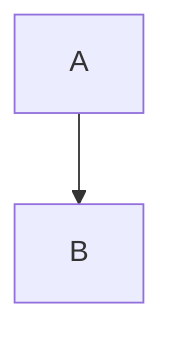

Every special construct lives here: a body edit must not move a single byte of them.

## A heading

The shortcode, Mermaid, math, code block and image all follow this paragraph.


A shortcode.




Block math:

$$
a^2 + b^2 = c^2
$$

Inline math: \(x = 1\).

A code block:

```js
const answer = 42;
```

A list:

- first
- second

An image:


<!--more-->

<div class="fixture-div">raw HTML</div>
