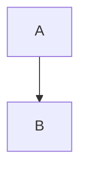

正文里放上每一种特殊构造，body 编辑必须一个字节都不动它们。


一个 shortcode。




一段行间公式：

$$
a^2 + b^2 = c^2
$$

一段行内公式：\(x = 1\)。

代码块：

```js
const answer = 42;
```

一个列表：

- 第一项
- 第二项

一张图片：


<!--more-->

<div class="fixture-div">原生 HTML</div>
